# 产品介绍

**1.简介**

你想学习编程知识吗?

只要你对科学充满热情，敢于探索新事物，这个Keyes 2021入门学习套件进阶版工具包一定是你的最佳选择。这个工具包是一款基于Arduino的Scratch图形化编程、Mixly图形化编程和C语言编程等三种编程方式的学习工具包。用一个控制器(Plus控制板)，许多传感器/模块和电子元件，你可以做许多精彩的DIY项目。该工具包附带31个项目教程，每个教程都有详细的接线图、元件知识，迷人的项目代码和项目结果等内容，完全适合初学者。你可以学习电子、物理、科学和编程等方面很多知识。

**2.清单**

当收到这个Keyes 2021入门学习套件进阶版工具包的时候，首先看到是一个包装精美的外盒，每个配件被安全且有序的装在外盒里面的小袋子里，先来清点一下：**(KE3016含Plus开发板，KE3015不含Plus开发板)**

| 序号 | 名称                                | 数量 | 图片                                                         |
| ---- | ----------------------------------- | ---- | ------------------------------------------------------------ |
| 1    | Plus 开发板                         | 1    | 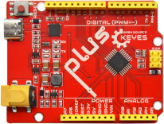                       |
| 2    | 传感器扩展板                        | 1    | 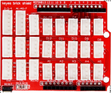                       |
| 3    | 蓝色LED                             | 10   | 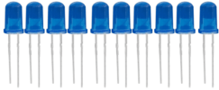                       |
| 4    | 红色LED                             | 10   | 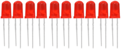                       |
| 5    | 黄色LED                             | 10   | 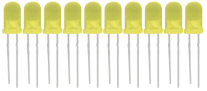                       |
| 6    | 绿色LED                             | 10   | 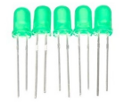                       |
| 7    | RGB                                 | 1    |  |
| 8    | 220Ω电阻                            | 10   | 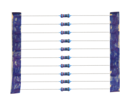                       |
| 9    | 10KΩ电阻                            | 10   | 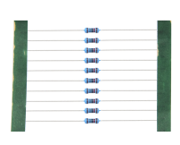                       |
| 10   | 1KΩ电阻                             | 10   | 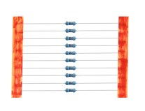                       |
| 11   | 4.7KΩ电阻                           | 10   | 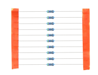                       |
| 12   | 10KΩ电位器                          | 1    | 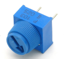                       |
| 13   | 有源蜂鸣器                          | 1    | 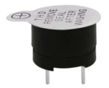                       |
| 14   | 无源蜂鸣器                          | 1    | 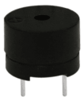                       |
| 15   | 按键开关                            | 4    | 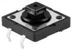                       |
| 16   | 倾斜开关                            | 1    | 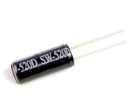                       |
| 17   | 光敏电阻                            | 2    | 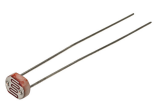                       |
| 18   | 火焰传感器                          | 1    | 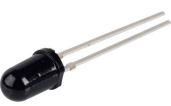                       |
| 19   | 10KΩ热敏电阻                        | 1    | 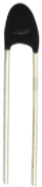                       |
| 20   | 黄帽                                | 4    |                        |
| 21   | IC 74HC595N                         | 1    | 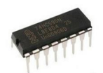                       |
| 22   | 摇杆模块                            | 1    | 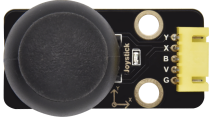                       |
| 23   | 一位数码管                          | 1    | 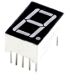                       |
| 24   | 四位数码管                          | 1    | 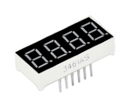                       |
| 25   | 8*8点阵屏                           | 1    | 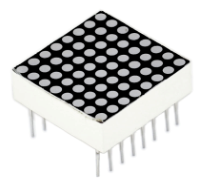                       |
| 26   | IC L293D                            | 1    | 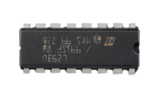                       |
| 27   | 1602 I2C LCD                        | 1    | 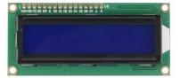                       |
| 28   | 红外接收器                          | 1    | 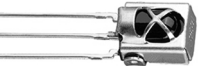                       |
| 29   | ESP8266串口WIFI ESP-01              | 1    | 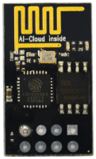                       |
| 30   | 人体红外传感器                      | 1    | 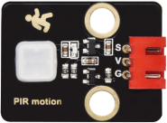                       |
| 31   | 风扇叶                              | 1    |                        |
| 32   | 直流电机                            | 1    | 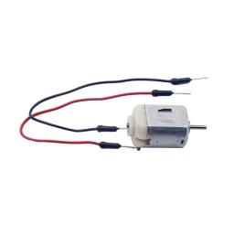                       |
| 33   | USB转ESP-01S WIFI模块串口测试扩展板 | 1    | 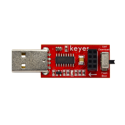                       |
| 34   | 步进电机驱动板                      | 1    | 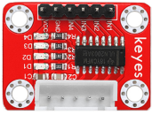                       |
| 35   | 步进电机                            | 1    | 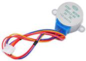                       |
| 36   | 红外遥控器                          | 1    |                        |
| 37   | 舵机                                | 1    | 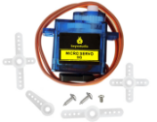                       |
| 38   | 超声波传感器                        | 1    | 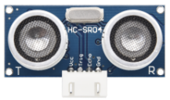                       |
| 39   | 5V继电器模块                        | 1    | 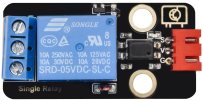                       |
| 40   | 4*4薄膜键盘                         | 1    | 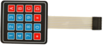                       |
| 41   | 面包板连接线                        | 30   | 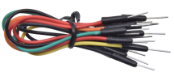                       |
| 42   | 公对母杜邦线                        | 10   | 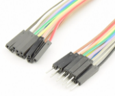                       |
| 43   | 3P双头连接线                        | 3    | 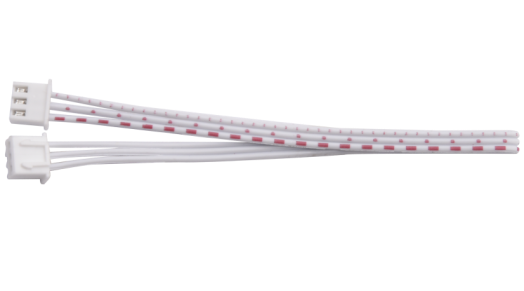                       |
| 44   | 4P双头连接线                        | 3    | 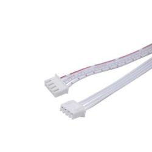                       |
| 45   | 5P双头连接线                        | 3    | 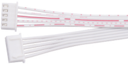 |
| 46   | 830孔面包板                         | 1    | 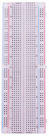                       |
| 47   | USB线                               | 1    |                        |
| 48   | 电阻卡                              | 1    | 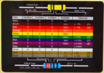                       |
| 49   | 公对公杜邦线                        | 10   |                        |

**3.Keyestudio Uno PLUS控制板**

在我们开始Keyes 2021入门学习套件进阶版工具包之前，我们首先介绍Keyestudio Uno PLUS控制板，它是所有项目的核心。Keyestudio Uno PLUS控制板完全兼容Arduino IDE开发环境的控制板，包含Arduino UNO R3的所有功能，并且在 UNO R3板的基础上，我们做了一些改进，使它的功能更加强大。它是学习如何构建电路和设计自己的代码的最好的选择。让我们得到更详细的相关信息。

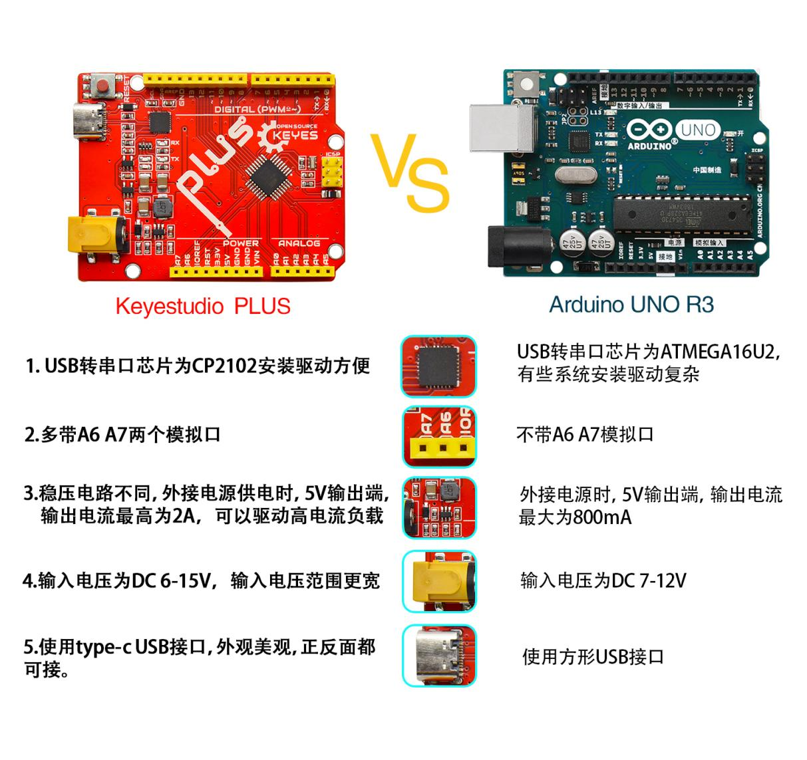

规格参数：

- 微控制器：ATMEGA328P-AU

- USB转串口芯片：CP2102

- 工作电压：DC 5V

- 外接电源: DC 6-15V（建议9V）

- 数字I/O引脚: 14 (D0-D13)

- PWM通道：6 (D3 D5 D6 D9 D10 D11)

- 模拟输入通道（ADC）: 8(A0-A7)

- 每个I/O直流输出能力: 20 mA

- 3.3V端口输出能力: 50 mA

- Flash Memory: 32 KB（其中引导程序使用0.5 KB）

- SRAM:2 KB (ATMEGA328P-AU)

- EEPROM: 1 KB (ATMEGA328P-AU)

- 时钟速度:16MHz

- 板载LED引脚:D13

各个接口和主要元件说明：

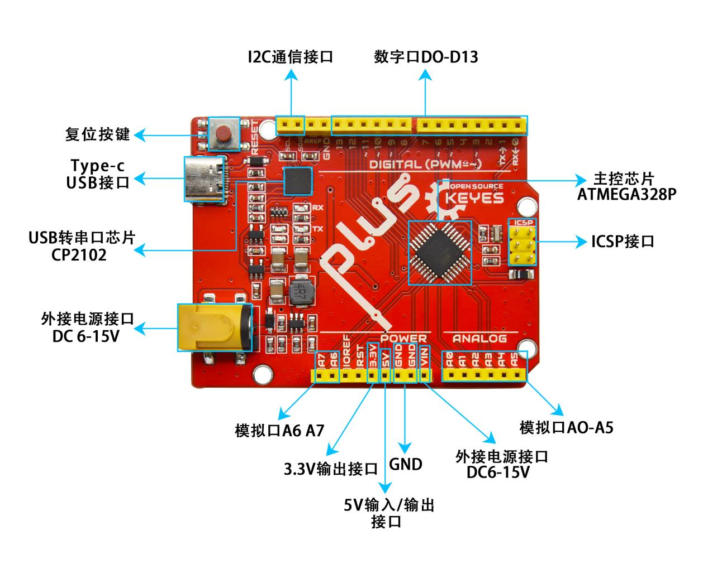

特殊功能接口说明：

- 串口通信接口：D0为RX、D1为TX

- PWM接口（脉宽调制）：D3 D5 D6 D9 D10 D11

- 外部中断接口：D2(中断0)和D3 (中断1)

- SPI通信接口：D10为SS、D11为MOSI、D12为MISO、D13为SCK

- IIC通信端口：A4为SDA、A5为SCL
