# Arduino 课程

## 资料下载

- [项目代码](./项目代码.zip)
- [Arduino库文件](./Arduino库文件.zip)
- [APP](./APP.zip)

## Arduino软件

### 1. 安装Windows驱动程序


#### 1.1 下载安装Arduino软件

访问Arduino官方网站：[<u>https://www.arduino.cc/</u>](https://www.arduino.cc/)，下载最新版本的Arduino软件。点击**DOWNLOADS**，选择您所需的版本（如Windows、Mac、Linux等）。


选择版本后，下载Arduino 1.8.13版本的安装程序。点击**JUST DOWNLOAD**即可。


安装时，请选择要安装的组件并确认安装目录，然后点击“安装”。如果出现警告，请允许驱动程序安装。


如果出现提示，请选择**Install**。


### 1.2 在Windows系统上安装驱动

在使用Keyes Uno Plus控制板之前，需要安装CP2102驱动程序。确保Arduino IDE版本为1.8.0或更高版本。如果没有自动安装驱动，请访问[CP2102驱动程序下载链接](https://fs.keyestudio.com/CP2102-WIN)。

通过设备管理器确保CP2102驱动安装成功，显示正常状态。

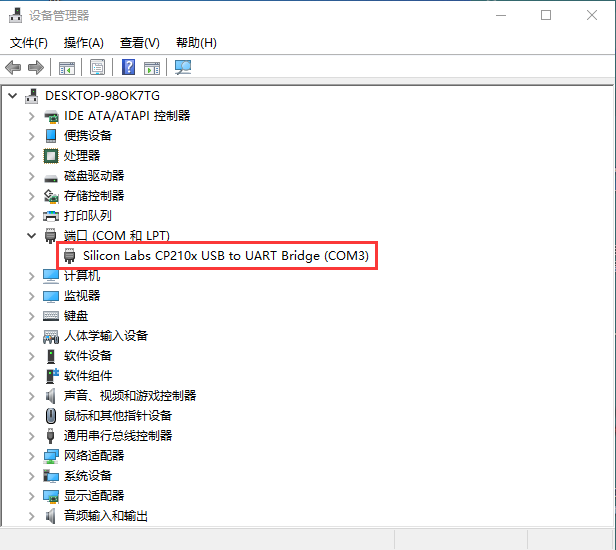

如果出现感叹号，右键单击并选择手动更新驱动程序。选择Arduino软件中的drivers文件夹，找到CP2102驱动程序进行安装。


### 1.3 配置Arduino IDE

成功安装驱动后，打开Arduino IDE，配置对应的开发板和COM端口。在菜单中选择**工具→开发板→Arduino Uno**，并选择正确的COM端口。

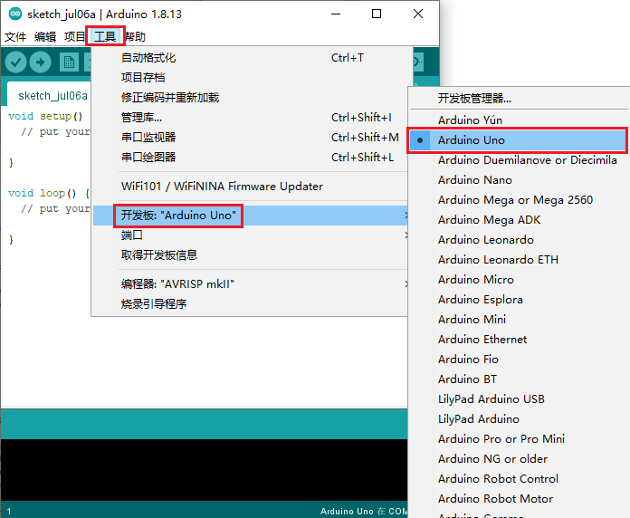

### 1.4 开始第一个程序

打开Arduino IDE，选择**文件→示例→Basics→Blink**，点击上传程序，控制板的LED将开始闪烁，您已成功完成第一个项目。

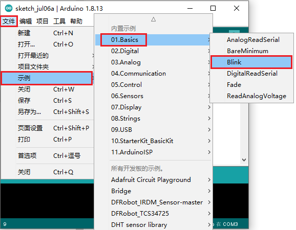

### 2. 在Mac系统上安装驱动

#### 2.1 下载安装Arduino软件


#### 2.2 下载CP2102的驱动程序

访问[CP2102-MAC驱动下载链接](https://fs.keyestudio.com/CP2102-MAC)。

#### 2.3 安装CP2102驱动程序

将Keyes Uno PLUS控制板连接到Mac电脑，打开Arduino IDE，选择对应的主板型号和串口。


点击上传程序，查看上传结果。


如果上传失败，请按照下载驱动的步骤进行安装。

### 3. 将库文件安装到Arduino

#### 3.1 手动安装库

准备一个库文件的ZIP文件并解压，将其放入Arduino文件夹中的libraries目录下。以IR Remote库为例，可从[IR Remote GitHub链接](https://github.com/shirriff/Arduino-IRremote)下载。


将下载的库文件解压并移动到Arduino的libraries文件夹中。

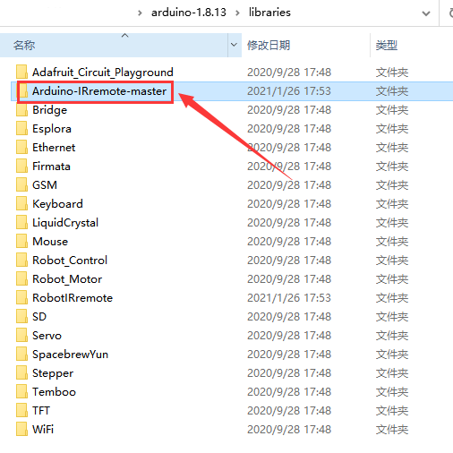

建议使用提供的库文件将其依次解压后复制到libraries文件夹中，以完成库的添加。


---


## 项目

### 项目1: Hello World

1. **项目介绍：**

对于Arduino初学者，我们将从一些简单的东西开始。在这个项目中，您只需要一个Plus开发板和USB电缆来完成“Hello World!”项目。它不仅是Arduino板和PC的通信测试，也是Arduino世界的初级项目。

2. **项目元件：**

|  |  |
| - | - |
| Keyes Uno Plus 开发板*1 | USB 线*1 |

3. **项目接线：**

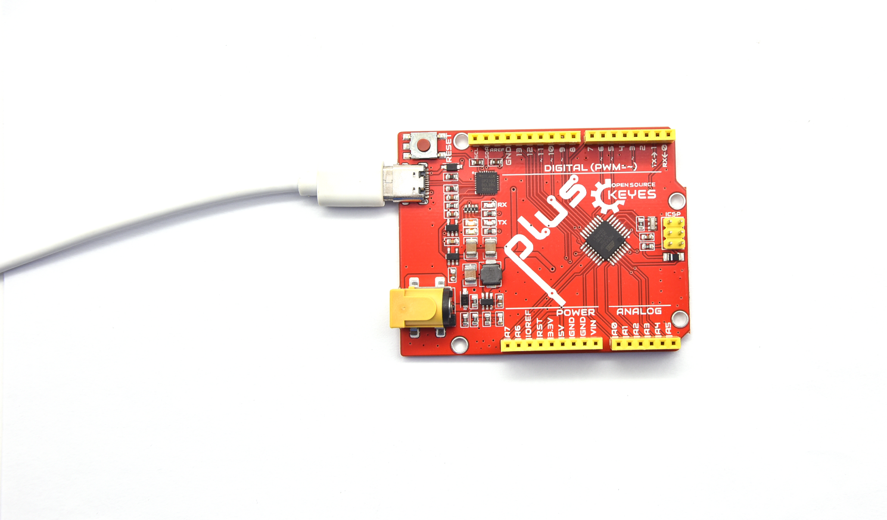

4. **项目代码：**

将使用一个简单的If()语句编程控制结构。Arduino使用串行监视器来显示打印语句、传感器数据等信息。这是一个非常强大的工具，用于调试长代码。现在是你的第一个代码：

```cpp
/*
Keyes 2021入门学习套件
Project 1
Hello World
http://www.keyes-robot.com
*/

char val; // 定义变量val.

void setup() {
    Serial.begin(9600); // 设置波特率为9600.
}

void loop() {
    if (Serial.available() > 0) {
        val = Serial.read(); // 读取指令或字符从PC到Arduino，并赋值给val.
        if (val == 'R') { // 确定接收的指令或字符是否为“R”.
            Serial.println("Hello World!"); // 显示“Hello World !”字符串.
        }
    }
}
```

5. **项目结果：**

选择正确的Arduino IDE主板类型和COM端口，点击Arduino IDE上的上传按钮上传代码。上传成功后，单击图标进入串行显示器。


每当你在文本框中输入一个“R”，并单击“发送”，串行监视器将显示一个“Hello World！”。


---

### 项目2: LED闪烁 

1. **项目介绍：**

在这个项目中，我们将向你展示LED闪烁效果。我们使用Arduino的数字引脚打开LED，让它闪烁。

2. **项目元件：**

|  |  |  |  |  |  |
| - | - | - | - | - | - |
| Keyes Uno Plus 控制板*1 | 红色LED*1 | 220Ω电阻*1 | 面包板*1 | 跳线*2 | USB 线*1 |

3. **元件知识：**

（1）**LED:**

LED是一种被称为“发光二极管”的半导体，是一种由半导体材料(硅、硒、锗等)制成的电子器件。它有正极和负极。短腿为负极，接GND，长腿为正极，接5V。


（2）**五色环电阻**

电阻是电路中限制或调节电流流动的电子元件。电阻(R)的单位为欧姆(Ω)。


我们可以使用电阻来保护敏感组件，如LED。

（3）**面包板**

面包板是实验室中用于搭接电路的重要工具。


4. **项目电路图和接线图：**


电路图


接线图

**注意:** 怎样连接LED


**怎样识别五色环220Ω电阻**


5. **项目代码：**

```cpp
/*
Keyes 2021入门学习套件
Project 2
LED_Blinking
http://www.keyes-robot.com
*/

int ledPin = 10; // 定义数字引脚10.

void setup() {
    pinMode(ledPin, OUTPUT); // 定义led引脚为输出.
}

void loop() {
    digitalWrite(ledPin, HIGH); // 点亮LED.
    delay(1000); // 等待1秒.
    digitalWrite(ledPin, LOW); // 熄灭LED.
    delay(1000); // 等待1秒.
}
```

6. **项目结果：**

烧录好项目代码，按照接线图连接好线，上电后，连接控制板D10引脚的LED灯每秒亮/灭一次。

7. **代码说明:**

`pinMode(ledPin，OUTPUT)` - 在使用Arduino的引脚之前，您需要告诉控制板它是INPUT还是OUTPUT。

---

### 项目3: 呼吸灯

1. **项目介绍：**

在这个项目中，我们将学习ARDUINO的PWM控制。PWM是脉宽调制(Pulse Width Modulation)的缩写，是一种将模拟信号电平编码为数字信号电平的技术。使用PWM可以控制LED从亮→暗，循环进行。

2. **项目元件：**

|  |  |  |  |  |  |
| - | - | - | - | - | - |
| Keyes Uno Plus 控制板*1 | 红色LED*1 | 220Ω电阻*1 | 面包板*1 | 跳线*2 | USB 线*1 |

3. **元件知识：**

脉宽调制的工作原理是改变信号的开和关时间来改变LED的亮度。

4. **项目电路图和接线图：**


**注意:** 怎样连接LED


**怎样识别五色环220Ω电阻**


5. **项目代码：**

```cpp
/*
Keyes 2021入门学习套件
Project 3
Breathing_Led
http://www.keyes-robot.com
*/

int ledPin = 6;

void setup() {
    pinMode(ledPin, OUTPUT);
}

void loop() {
    for (int value = 0; value < 255; value = value + 1) {
        analogWrite(ledPin, value);
        delay(5);
    }

    for (int value = 255; value > 0; value = value - 1) {
        analogWrite(ledPin, value);
        delay(5);
    }
}
```

6. **项目结果：**

烧录好项目代码，按照接线图连接好线，上电后，您会看到LED灯逐渐亮起来，然后逐渐变暗。循环进行！

---

### 项目4: 交通灯

1. **项目介绍：**

交通灯在我们的日常生活中很普遍。在这个项目中，我们将使用一个Plus控制板和一些LED（红，黄，绿）来模拟交通灯。

2. **项目元件：**

|  |  |  |  |
| - | - | - | - |
| Keyes Uno Plus 控制板*1 | 红色LED*1 | 黄色 LED*1 | 绿色LED*1 |
|  |  |  |  |
| USB 线*1 | 220Ω电阻*3 | 面包板*1 | 跳线若干 |

3. **项目电路图和接线图：**


**注意:** 怎样连接LED


**怎样识别五色环220Ω电阻**


4. **项目代码：**

```cpp
/*
Keyes 2021入门学习套件
Project 4
Traffic_Light
http://www.keyes-robot.com
*/

int redled = 10; // 初始化数字管脚10.
int yellowled = 7; // 初始化数字管脚7.
int greenled = 4; // 初始化数字管脚4.

void setup() {
    pinMode(redled, OUTPUT); // 将红色LED引脚设置为“output”
    pinMode(yellowled, OUTPUT); // 将黄色LED引脚设置为“output”
    pinMode(greenled, OUTPUT); // 将绿色LED的引脚设置为“output”
}

void loop() {
    digitalWrite(greenled, HIGH); // 点亮绿色LED
    delay(5000); // 延时5秒
    digitalWrite(greenled, LOW); // 熄灭绿色LED

    for (int i = 0; i < 3; i++) { // 闪烁3次
        delay(500); // 延时0.5秒
        digitalWrite(yellowled, HIGH); // 点亮黄色LED
        delay(500); // 延时0.5秒
        digitalWrite(yellowled, LOW); // 熄灭黄色LED
    }

    delay(500); // 延时0.5秒
    digitalWrite(redled, HIGH); // 点亮红色LED
    delay(5000); // 延时5秒
    digitalWrite(redled, LOW); // 熄灭红色LED
}
```

5. **项目结果：**

烧录好项目代码，按照接线图连接好线，上电后，您将看到交通灯的变化，绿灯亮5秒，随后黄灯闪烁3次，最后红灯亮5秒，循环进行。

---

### 项目5: RGB LED

1. **项目介绍：**

RGB LED由三种颜色(红、绿、蓝)组成，通过混合这三种基本颜色可以发出不同的颜色。在这个项目中，我们将向您介绍RGB LED，并向您展示如何使用Plus控制板控制RGB LED发出不同的颜色光。

2. **项目元件：**

|  |  |  |  |  |  |
| - | - | - | - | - | - |
| Keyes Uno Plus 控制板*1 | RGB LED*1 | 220Ω电阻*3 | 面包板*1 | 跳线若干 | USB 线*1 |

3. **元件知识：**

显示器大多遵循RGB颜色标准，电脑屏幕上的所有颜色都是由红、绿、蓝三种颜色以不同比例混合而成。

4. **项目电路图和接线图：**


**注意:** RGB LED最长引脚(共阴极)连接GND。

5. **项目代码：**

```cpp
/*
Keyes 2021入门学习套件
Project 5
RGB LED
http://www.keyes-robot.com
*/

int redpin = 11; //选择红色LED的引脚
int bluepin = 9; //选择蓝色LED的引脚
int greenpin = 10; //选择绿色LED的引脚
int val;

void setup() {
    pinMode(redpin, OUTPUT);
    pinMode(bluepin, OUTPUT);
    pinMode(greenpin, OUTPUT);
}

void loop() {
    for (val = 255; val > 0; val--) {
        analogWrite(redpin, val);
        analogWrite(greenpin, 255 - val);
        analogWrite(bluepin, 128 - val);
        delay(1);
    }
    for (val = 0; val < 255; val++) {
        analogWrite(redpin, val);
        analogWrite(greenpin, 255 - val);
        analogWrite(bluepin, 128 - val);
        delay(1);
    }
}
```

6. **项目结果：**

烧录好项目代码，按照接线图连接好线，上电后，几秒钟后，您会看到一个彩色的LED。


### 项目6: 流水灯

1. **项目介绍：**

在日常生活中，我们可以看到许多由不同颜色的LED组成的广告牌，它们不断地改变灯光来吸引顾客的注意。在这个项目中，我们将使用Plus控制板和5个LED实现流水的效果。

2. **项目元件：**

|  |  |  |  |  |  |
| - | - | - | - | - | - |
| Keyes Uno Plus 控制板*1 | 红色LED*5 | 220Ω电阻*5 | 面包板*1 | 跳线若干 | USB 线*1 |

3. **项目电路图和接线图:**


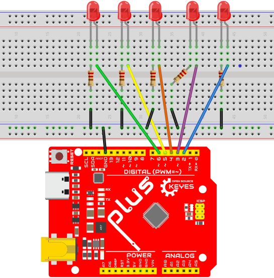

**注意:** 

怎样连接LED


怎样识别五色环220Ω电阻


4. **项目代码：**

```cpp
/*
Keyes 2021入门学习套件
Project 6
Running_water_light
http://www.keyes-robot.com
*/

int BASE = 2; // 第一个LED的I/O引脚
int NUM = 5; // LED 数量

void setup() {
    for (int i = BASE; i < BASE + NUM; i++) {
        pinMode(i, OUTPUT); // 设置I/O引脚为输出
    }
}

void loop() {
    for (int i = BASE; i < BASE + NUM; i++) {
        digitalWrite(i, LOW); // 设I/O引脚为低电平，依次熄灭LED灯。
        delay(200); // 延时
    }
    for (int i = BASE; i < BASE + NUM; i++) {
        digitalWrite(i, HIGH); // 设置I/O引脚为高，依次点亮LED灯
        delay(200); // 延时
    }
}
```

5. **项目结果：**

烧录好项目代码，按照接线图连接好线，上电后，连接开发板D2-D6引脚的5个LED会逐渐亮起来，然后逐渐熄灭，就像电池充电一样。

---

### 项目7: 有源蜂鸣器

1. **项目介绍：**

有源蜂鸣器是一个发声组件。它被广泛用于电脑、打印机、报警器、电子玩具、电话和计时器等设备。它有一个内在的振动源，连接5V电源即可持续发出嗡嗡声。在这个项目中，我们将使用Plus控制板控制有源蜂鸣器发出嗡嗡声。

2. **项目元件：**

|  |  |  |  |  |
| - | - | - | - | - |
| Keyes Uno Plus 控制板*1 | 有源蜂鸣器*1 | 面包板*1 | 跳线若干 | USB 线*1 |

3. **元件知识：**

有源蜂鸣器内部含有简单的振荡器电路，将恒定的直流电转换为特定频率的脉冲信号。一旦有源蜂鸣器收到高电平信号，它将产生声音。与此不同，无源蜂鸣器内部没有振动源，必须由2K-5K方波驱动才能发声。这两个蜂鸣器的外观相似，但有源蜂鸣器通常带有黑色胶带，而无源蜂鸣器的电路板为绿色。

4. **项目电路图和接线图：**


**注意:** 有源蜂鸣器正极（“+”/长引脚）接引脚8，负极（短引脚）接GND。

5. **项目代码：**

```cpp
/*
Keyes 2021入门学习套件
Project 7
Active_buzzer
http://www.keyes-robot.com
*/

int buzzerPin = 8;

void setup() {
    pinMode(buzzerPin, OUTPUT);
}

void loop() {
    digitalWrite(buzzerPin, HIGH);
    delay(500);
    digitalWrite(buzzerPin, LOW);
    delay(500);
}
```

6. **项目结果：**

烧录好项目代码，按照接线图连接好线，上电后，有源蜂鸣器发出嗡嗡声。

---

### 项目8: 无源蜂鸣器

1. **项目介绍：**

在之前的项目中，我们学习了有源蜂鸣器，它只能发出一种声音，可能会让你觉得很单调。这个项目将学习另一种蜂鸣器，即无源蜂鸣器。与有源蜂鸣器不同，无源蜂鸣器能够发出不同频率的声音。在这个项目中，你将使用Plus控制板控制无源蜂鸣器演奏一首歌曲。

2. **项目元件：**

|  |  |  |  |  |
| - | - | - | - | - |
| Keyes Uno Plus 控制板*1 | 无源蜂鸣器*1 | 面包板*1 | 跳线若干 | USB 线*1 |

3. **元件知识：**

无源蜂鸣器是一种内部没有振动源的集成电子蜂鸣器。它必须由2K-5K方波驱动，而不是直流信号。这两个蜂鸣器的外观非常相似，绿色电路板的是无源蜂鸣器，而黑色胶带的是有源蜂鸣器。

4. **项目电路图和接线图:**


5. **项目代码：**

```cpp
/*
Keyes 2021入门学习套件
Project 8
Passive_buzzer
http://www.keyes-robot.com
*/

#define NOTE_B0 31
#define NOTE_C1 33
#define NOTE_CS1 35
// 省略其余音符定义...
#define NOTE_0 0

int tempo = 114; // 改变这个可使歌曲变慢或变快
int buzzer = 8; // 使用的引脚

int melody[] = {
    NOTE_E4, 4, NOTE_E4, 4, // 主要音符
    // 省略其余音符...
};

int notes = sizeof(melody) / sizeof(melody[0]) / 2;
int wholenote = (60000 * 4) / tempo;
int divider = 0, noteDuration = 0;

void setup() {
    for (int thisNote = 0; thisNote < notes * 2; thisNote += 2) {
        divider = melody[thisNote + 1];
        if (divider > 0) {
            noteDuration = (wholenote) / divider; // 常规音符
        } else if (divider < 0) {
            noteDuration = (wholenote) / abs(divider);
            noteDuration *= 1.5; // 带点的音符
        }
        tone(buzzer, melody[thisNote], noteDuration * 0.9);
        delay(noteDuration);
        noTone(buzzer); // 停止声音
    }
}

void loop() {
    // 若想重复歌曲，复制上面的代码
}
```

6. **项目结果：**

烧录好项目代码，按照接线图连接好线，上电后，无源蜂鸣器将演奏一首歌曲。

---

### 项目9: 74HC595N控制7个LED 

1. **项目介绍：**

在之前的项目中，我们已经学过了如何点亮一个LED。Plus控制板上只有22个IO端口。我们如何点亮大量的LED呢？有时可能会耗尽Arduino板上的引脚，这时候需要用移位寄存器扩展它。你可以使用74HC595N芯片一次控制8个输出，而只占用你的微控制器上的几个引脚。在这个项目中，我们将使用Plus控制板和74HC595N控制7个红色LED的亮灭变化。

2. **项目元件：**

|  |  |  |  |  |  |  |
| - | - | - | - | - | - | - |
| Keyes Uno Plus 控制板*1 | 红色LED*7 | 74HC595N芯片*1 | 220Ω电阻*7 | 面包板*1 | 跳线若干 | USB 线*1 |

3. **元件知识：**

74HC595N芯片不仅具有8位移位寄存器，还具备存储器和三态输出功能。移位寄存器的输入与输出是同步于不同的时钟，它能够将串行数据转为并行数据，从而可以控制多个LED。它的引脚组合非常灵活，能够通过链式连接扩展更多的输出设备。

4. **项目电路图和接线图：**


**注意:** 需要注意74HC595N芯片插入的方向。

5. **项目代码：**

```cpp
/*
Keyes 2021入门学习套件
Project 9
74HC595N_control_7_LEDS
http://www.keyes-robot.com
*/

int data = 4; // 将74HC595的4引脚设置为数据输入引脚
int clock = 6; // 将74HC595的6引脚设置为时钟引脚
int latch = 5; // 将74HC595的5引脚设置为输出锁存器

void setup() {
    pinMode(data, OUTPUT);
    pinMode(clock, OUTPUT);
    pinMode(latch, OUTPUT);
}

void loop() {
    for (int i = 0; i < 256; i++) {
        updateLEDs(i);
        delay(500);
    }
}

void updateLEDs(int value) {
    digitalWrite(latch, LOW); // 锁存器低电平
    shiftOut(data, clock, MSBFIRST, ~value); // 串行数据输出，高电平优先
    digitalWrite(latch, HIGH); // 锁存器高电平
}
```

6. **项目结果：**

烧录好项目代码，按照接线图连接好线，上电后，可以看到7个LED灯亮灭变化情况，循环往复进行。

---

### 项目10: 一位数码管

1. **项目介绍：**

七段数码管是一种显示十进制数字的电子显示设备，广泛应用于数字时钟、电子仪表、计算器等设备。在这个项目中，我们将在Plus控制板上控制一位数码管显示数字。

2. **项目元件：**

|  |  |  |  |  |  |
| - | - | - | - | - | - |
| Keyes Uno Plus 控制板*1 | 一位数码管*1 | 220Ω电阻*8 | 面包板*1 | 跳线若干 | USB 线*1 |

3. **元件知识：**

七段数码管的基本原理是利用多个LED组合来显示数字。每个段由一个LED组成，常见的类型为共阴极。对于共阴极数码管，所有LED的负极连接在一起，正极个别控制。

4. **项目电路图和接线图：**

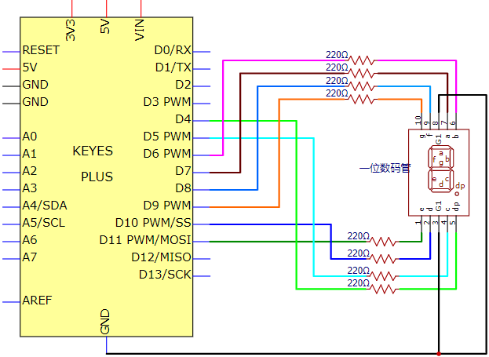

**注意:** 插入面包板的七段数码管方向与接线图一致。

5. **项目代码：**

```cpp
/*
Keyes 2021入门学习套件
Project 10
one_segment_display
http://www.keyes-robot.com
*/

// 设置每段的IO引脚
int a = 7; // 设置a段数字引脚为7
int b = 6; // 设置b段数字引脚为6
int c = 5; // 设置c段数字引脚为5
int d = 10;// 设置d段数字引脚为10
int e = 11;// 设置e段数字引脚为11
int f = 8; // 数字f段引脚为8
int g = 9; // 设置g段引脚为9
int dp = 4;// 设置dp段引脚为4

// 显示各个数字的程序...
void setup() {
    for (int i = 4; i <= 11; i++)
        pinMode(i, OUTPUT); // 设置引脚4-11为输出
}

void loop() {
    digital_9();
    delay(1000); // 等待1秒
    // 显示其他数字的代码...
}
```

6. **项目结果：**

烧录好项目代码，按照接线图连接好线，上电后，一位数码管将显示从9到0的数字。


### 项目11：四位数码管

1.  项目介绍：

4位7段数码管是一种非常实用的显示器件。电子时钟的显示，球场上的记分员，公园里的人数都是需要的。由于价格低廉，使用方便，越来越多的项目将使用4位7段数码管。在这个项目中，我们使用Plus
控制板控制4位7段数码管来显示0000-9999之间的数字。

2.  项目元件：

|||||||
|-|-|-|-|-|-|
|Keyes Uno Plus 控制板*1|四位数码管*1|220Ω 电阻*8|跳线若干|面包板*1|USB 线*1|

3.  元件知识：


四位数码管：四位数码管有共阳极和共阴极两种四位数码管，显示原理是和一位数码管是类似的，都是8个GPIO口控制数码管的显示段，就是8个led灯，不过，这里是4位的，所以就还需要4个GPIO口来控制位选择端，就是选择哪个单个数码管亮，位的切换很快，肉眼区分不出来，就能看起来是多个数码管同时显示的了。

我们的四位数码管是共阴极的。

下图为4位数码管的引脚图，G1、G2、G3、G4就是控制位的引脚。


下图为4位数码管内部布线原理图

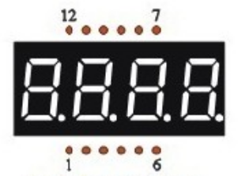

4.项目的电路图和接线图：

对于四位数码管，限流电阻是必不可少的。这里我们使用220Ω的8个电阻。

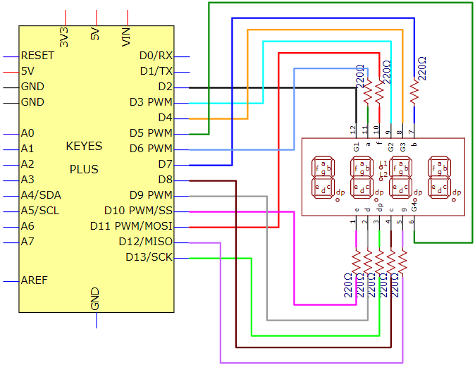


5. **项目代码：**

```cpp
/*
Keyes 2021入门学习套件
Project 11
Four_segment_display
http://www.keyes-robot.com
*/

// 设置段引脚
int a = 6; // a段引脚
int b = 7; // b段引脚
int c = 8; // c段引脚
int d = 9; // d段引脚
int e = 10; // e段引脚
int f = 11; // f段引脚
int g = 12; // g段引脚
int dp = 13; // dp（小数点）引脚
// 设置位选择引脚
int g4 = 5; // 第4位引脚
int g3 = 4; // 第3位引脚
int g2 = 3; // 第2位引脚
int g1 = 2; // 第1位引脚

// 设置变量
long n = 1230; // 初始化数字变量
int x = 100; // 初始值
int del = 55; // 时钟微调

void setup() {
    // 设置所有引脚为输出
    pinMode(g1, OUTPUT);
    pinMode(g2, OUTPUT);
    pinMode(g3, OUTPUT);
    pinMode(g4, OUTPUT);
    pinMode(a, OUTPUT);
    pinMode(b, OUTPUT);
    pinMode(c, OUTPUT);
    pinMode(d, OUTPUT);
    pinMode(e, OUTPUT);
    pinMode(f, OUTPUT);
    pinMode(g, OUTPUT);
    pinMode(dp, OUTPUT);
}

void loop() {
    int a = 0; // 每位的初始化
    int b = 0;
    int c = 0;
    int d = 0;
    unsigned long currentMillis = millis(); // 获取当前时间

    while (d >= 0) {
        while (millis() - currentMillis < 10) {
            // 显示各个数字
            Display(1, a);
            Display(2, b);
            Display(3, c);
            Display(4, d);
        }
        currentMillis = millis(); // 更新当前时间
        d++; // 自增

        // 控制进位
        if (d > 9) {
            c++;
            d = 0;
        }
        if (c > 9) {
            b++;
            c = 0;
        }
        if (b > 9) {
            a++;
            b = 0;
        }
        if (a > 9) {
            a = 0; // 重置
            b = 0;
            c = 0;
            d = 0;
        }
    }
}

// 选择数码管的位
void WeiXuan(unsigned char n) {
    switch (n) {
        case 1: // 第一位
            digitalWrite(g1, LOW);
            digitalWrite(g2, HIGH);
            digitalWrite(g3, HIGH);
            digitalWrite(g4, HIGH);
            break;
        case 2: // 第二位
            digitalWrite(g1, HIGH);
            digitalWrite(g2, LOW);
            digitalWrite(g3, HIGH);
            digitalWrite(g4, HIGH);
            break;
        case 3: // 第三位
            digitalWrite(g1, HIGH);
            digitalWrite(g2, HIGH);
            digitalWrite(g3, LOW);
            digitalWrite(g4, HIGH);
            break;
        case 4: // 第四位
            digitalWrite(g1, HIGH);
            digitalWrite(g2, HIGH);
            digitalWrite(g3, HIGH);
            digitalWrite(g4, LOW);
            break;
        default: // 关闭所有输出
            digitalWrite(g1, HIGH);
            digitalWrite(g2, HIGH);
            digitalWrite(g3, HIGH);
            digitalWrite(g4, HIGH);
            break;
    }
}

// 显示数字0
void Num_0() {
    digitalWrite(a, HIGH);
    digitalWrite(b, HIGH);
    digitalWrite(c, HIGH);
    digitalWrite(d, HIGH);
    digitalWrite(e, HIGH);
    digitalWrite(f, HIGH);
    digitalWrite(g, LOW);
    digitalWrite(dp, LOW);
}

// 显示数字1
void Num_1() {
    digitalWrite(a, LOW);
    digitalWrite(b, HIGH);
    digitalWrite(c, HIGH);
    digitalWrite(d, LOW);
    digitalWrite(e, LOW);
    digitalWrite(f, LOW);
    digitalWrite(g, LOW);
    digitalWrite(dp, LOW);
}

// 显示数字2
void Num_2() {
    digitalWrite(a, HIGH);
    digitalWrite(b, HIGH);
    digitalWrite(c, LOW);
    digitalWrite(d, HIGH);
    digitalWrite(e, HIGH);
    digitalWrite(f, LOW);
    digitalWrite(g, HIGH);
    digitalWrite(dp, LOW);
}

// 显示数字3
void Num_3() {
    digitalWrite(a, HIGH);
    digitalWrite(b, HIGH);
    digitalWrite(c, HIGH);
    digitalWrite(d, HIGH);
    digitalWrite(e, LOW);
    digitalWrite(f, LOW);
    digitalWrite(g, HIGH);
    digitalWrite(dp, LOW);
}

// 显示数字4
void Num_4() {
    digitalWrite(a, LOW);
    digitalWrite(b, HIGH);
    digitalWrite(c, HIGH);
    digitalWrite(d, LOW);
    digitalWrite(e, LOW);
    digitalWrite(f, HIGH);
    digitalWrite(g, HIGH);
    digitalWrite(dp, LOW);
}

// 显示数字5
void Num_5() {
    digitalWrite(a, HIGH);
    digitalWrite(b, LOW);
    digitalWrite(c, HIGH);
    digitalWrite(d, HIGH);
    digitalWrite(e, LOW);
    digitalWrite(f, HIGH);
    digitalWrite(g, HIGH);
    digitalWrite(dp, LOW);
}

// 显示数字6
void Num_6() {
    digitalWrite(a, HIGH);
    digitalWrite(b, LOW);
    digitalWrite(c, HIGH);
    digitalWrite(d, HIGH);
    digitalWrite(e, HIGH);
    digitalWrite(f, HIGH);
    digitalWrite(g, HIGH);
    digitalWrite(dp, LOW);
}

// 显示数字7
void Num_7() {
    digitalWrite(a, HIGH);
    digitalWrite(b, HIGH);
    digitalWrite(c, HIGH);
    digitalWrite(d, LOW);
    digitalWrite(e, LOW);
    digitalWrite(f, LOW);
    digitalWrite(g, LOW);
    digitalWrite(dp, LOW);
}

// 显示数字8
void Num_8() {
    digitalWrite(a, HIGH);
    digitalWrite(b, HIGH);
    digitalWrite(c, HIGH);
    digitalWrite(d, HIGH);
    digitalWrite(e, HIGH);
    digitalWrite(f, HIGH);
    digitalWrite(g, HIGH);
    digitalWrite(dp, LOW);
}

// 显示数字9
void Num_9() {
    digitalWrite(a, HIGH);
    digitalWrite(b, HIGH);
    digitalWrite(c, HIGH);
    digitalWrite(d, HIGH);
    digitalWrite(e, LOW);
    digitalWrite(f, HIGH);
    digitalWrite(g, HIGH);
    digitalWrite(dp, LOW);
}

// 清屏函数
void Clear() {
    digitalWrite(a, LOW);
    digitalWrite(b, LOW);
    digitalWrite(c, LOW);
    digitalWrite(d, LOW);
    digitalWrite(e, LOW);
    digitalWrite(f, LOW);
    digitalWrite(g, LOW);
    digitalWrite(dp, LOW);
}

// 选择数字8~9
void pickNumber(unsigned char n) {
    switch (n) {
        case 0: Num_0(); break;
        case 1: Num_1(); break;
        case 2: Num_2(); break;
        case 3: Num_3(); break;
        case 4: Num_4(); break;
        case 5: Num_5(); break;
        case 6: Num_6(); break;
        case 7: Num_7(); break;
        case 8: Num_8(); break;
        case 9: Num_9(); break;
        default: Clear(); break;
    }
}

// 点亮指定数字
void Display(unsigned char x, unsigned char Number) {
    WeiXuan(x);
    pickNumber(Number);
    delay(1);
    Clear(); // 清屏
}
```

6.项目结果：

烧录好项目代码，按照接线图连接好线，上电后，四位数码管显示0000-9999之间的数字。

### 项目12：点阵屏显示

1.  项目介绍：

点阵屏是一种电子数字显示设备，可以显示机器、钟表、公共交通离场指示器和许多其他设备上的信息。LED点阵显示能够满足不同应用需求，具有广阔的发展前景。LED点阵采用低压扫描，具有省电、使用寿命长、成本低、亮度高、视角宽、视野长、防水、规格多等优点。在这个项目中，我们将进行一个8\*8LED点阵显示实验，亲身体验它的魅力。

2.  项目元件：

|||||||
|-|-|-|-|-|-|
|Keyes Uno Plus 控制板*1|8*8点阵屏*1|220Ω 电阻*8|跳线若干|面包板*1|USB 线*1|

3.  元件知识：


8\*8点阵屏：8\*8的点阵由64个LED组成，每个LED被放置在一排和一列的交叉点上。点阵屏的外部视图如下所示：


当某一行(ROW)的电平为1，某一列(COL)的电平为0时，对应的LED会点亮。如果你想在第一个点上点亮LED，你应该设置引脚⑨为高电平，引脚⑬为低电平。如果你想在第一行点亮led，你应该设置引脚⑨为高电平，将引脚⑬、③、④、⑩、⑥、⑪、⑮和⑯设置为低电平。如果你想点亮第一列的led，将引脚⑬设置为低电平，将引脚⑨、⑭、⑧、⑫、①、⑦、②和⑤设置为高电平。

点阵屏的内部视图如下所示：


4.  项目电路图和接线图：


在面包板上接线时要正放（点阵屏上的788BS字样朝主控板方向）


5. **项目代码：**

```cpp
/*
Keyes 2021入门学习套件
Project 12
12_8_8_Matrix
http://www.keyes-robot.com
*/

// 定义行和列引脚
int R[] = {2, 3, 4, 5, 6, 7, 8, 9}; // 行引脚
int C[] = {10, 11, 12, 13, A0, A1, A2, A3}; // 列引脚

// 定义显示数据，8*8矩阵的每个元素控制对应位置的LED
unsigned char data_0[8][8] = {
    {0, 0, 1, 1, 1, 0, 0, 0},
    {0, 1, 0, 0, 0, 1, 0, 0},
    {0, 1, 0, 0, 0, 1, 0, 0},
    {0, 1, 0, 0, 0, 1, 0, 0},
    {0, 1, 0, 0, 0, 1, 0, 0},
    {0, 1, 0, 0, 0, 1, 0, 0},
    {0, 1, 0, 0, 0, 1, 0, 0},
    {0, 0, 1, 1, 1, 0, 0, 0}
};

// 其他图案数据定义...
unsigned char data_1[8][8] = {
    {0, 0, 0, 0, 1, 0, 0, 0},
    {0, 0, 0, 1, 1, 0, 0, 0},
    {0, 0, 0, 0, 1, 0, 0, 0},
    {0, 0, 0, 0, 1, 0, 0, 0},
    {0, 0, 0, 0, 1, 0, 0, 0},
    {0, 0, 0, 0, 1, 0, 0, 0},
    {0, 0, 0, 0, 1, 0, 0, 0},
    {0, 0, 0, 1, 1, 1, 0, 0}
};

// 定义数据2到数据9的图案数据...
unsigned char data_2[8][8] = {
    {0, 0, 1, 1, 1, 0, 0, 0},
    {0, 1, 0, 0, 0, 1, 0, 0},
    {0, 0, 0, 0, 0, 1, 0, 0},
    {0, 0, 0, 0, 1, 0, 0, 0},
    {0, 0, 0, 1, 0, 0, 0, 0},
    {0, 0, 1, 0, 0, 0, 0, 0},
    {0, 1, 1, 1, 1, 1, 0, 0},
    {0, 0, 0, 0, 0, 0, 0, 0}
};

unsigned char data_3[8][8] = {
    {0, 0, 1, 1, 1, 1, 0, 0},
    {0, 0, 0, 0, 0, 1, 0, 0},
    {0, 0, 0, 0, 0, 1, 0, 0},
    {0, 0, 1, 1, 1, 1, 0, 0},
    {0, 0, 0, 0, 0, 1, 0, 0},
    {0, 0, 0, 0, 0, 1, 0, 0},
    {0, 0, 1, 1, 1, 1, 0, 0},
    {0, 0, 0, 0, 0, 0, 0, 0}
};

unsigned char data_4[8][8] = {
    {0, 1, 0, 0, 0, 0, 0, 0},
    {0, 1, 0, 0, 1, 0, 0, 0},
    {0, 1, 0, 0, 1, 0, 0, 0},
    {0, 1, 1, 1, 1, 1, 1, 0},
    {0, 0, 0, 0, 1, 0, 0, 0},
    {0, 0, 0, 0, 1, 0, 0, 0},
    {0, 0, 0, 0, 1, 0, 0, 0},
    {0, 0, 0, 0, 0, 0, 0, 0}
};

unsigned char data_5[8][8] = {
    {0, 1, 0, 0, 0, 0, 0, 0},
    {0, 1, 1, 1, 1, 1, 0, 0},
    {0, 1, 0, 0, 0, 0, 0, 0},
    {0, 1, 1, 1, 1, 1, 0, 0},
    {0, 0, 0, 0, 0, 1, 0, 0},
    {0, 0, 0, 0, 0, 1, 0, 0},
    {0, 1, 1, 1, 1, 1, 0, 0},
    {0, 0, 0, 0, 0, 0, 0, 0}
};

unsigned char data_6[8][8] = {
    {0, 1, 1, 1, 1, 1, 0, 0},
    {0, 1, 0, 0, 0, 0, 0, 0},
    {0, 1, 0, 0, 0, 0, 0, 0},
    {0, 1, 1, 1, 1, 1, 0, 0},
    {0, 1, 0, 0, 0, 1, 0, 0},
    {0, 1, 0, 0, 0, 1, 0, 0},
    {0, 1, 1, 1, 1, 1, 0, 0},
    {0, 0, 0, 0, 0, 0, 0, 0}
};

unsigned char data_7[8][8] = {
    {0, 0, 0, 0, 0, 0, 0, 0},
    {0, 1, 1, 1, 1, 1, 0, 0},
    {0, 0, 0, 0, 0, 1, 0, 0},
    {0, 0, 0, 0, 1, 0, 0, 0},
    {0, 0, 0, 1, 0, 0, 0, 0},
    {0, 0, 1, 0, 0, 0, 0, 0},
    {0, 1, 0, 0, 0, 0, 0, 0},
    {0, 0, 0, 0, 0, 0, 0, 0}
};

unsigned char data_8[8][8] = {
    {0, 1, 1, 1, 1, 1, 0, 0},
    {0, 1, 0, 0, 0, 1, 0, 0},
    {0, 1, 0, 0, 0, 1, 0, 0},
    {0, 1, 1, 1, 1, 1, 0, 0},
    {0, 1, 0, 0, 0, 1, 0, 0},
    {0, 1, 0, 0, 0, 1, 0, 0},
    {0, 1, 1, 1, 1, 1, 0, 0},
    {0, 0, 0, 0, 0, 0, 0, 0}
};

unsigned char data_9[8][8] = {
    {0, 1, 1, 1, 1, 1, 0, 0},
    {0, 1, 0, 0, 0, 1, 0, 0},
    {0, 1, 0, 0, 0, 1, 0, 0},
    {0, 1, 1, 1, 1, 1, 0, 0},
    {0, 0, 0, 0, 0, 1, 0, 0},
    {0, 0, 0, 0, 0, 1, 0, 0},
    {0, 1, 1, 1, 1, 1, 0, 0},
    {0, 0, 0, 0, 0, 0, 0, 0}
};

// 显示数据的函数
void Display(unsigned char dat[8][8]) {
    for(int c = 0; c < 8; c++) { // 遍历列
        digitalWrite(C[c], LOW); // 设置当前列低电平
        for(int r = 0; r < 8; r++) { // 遍历行
            digitalWrite(R[r], dat[r][c]); // 根据数据设置行状态
        }
        delay(1); // 稍作延迟
        Clear(); // 清屏
    }
}

// 清屏函数
void Clear() {
    for(int i = 0; i < 8; i++) {
        digitalWrite(R[i], LOW); // 设置行引脚低电平
        digitalWrite(C[i], HIGH); // 设置列引脚高电平
    }
}

// 初始化设置，定义行列引脚状态
void setup() {
    for(int i = 0; i < 8; i++) { // 初始化行引脚
        pinMode(R[i], OUTPUT);
        pinMode(C[i], OUTPUT); // 初始化列引脚
    }
}

// 主循环函数
void loop() {
    // 按顺序显示每个数据图案
    for (int i = 1; i <= 100; i++) {
        Display(data_0);
    }
    for (int i = 1; i <= 100; i++) {
        Display(data_1);
    }
    for (int i = 1; i <= 100; i++) {
        Display(data_2);
    }
    for (int i = 1; i <= 100; i++) {
        Display(data_3);
    }
    for (int i = 1; i <= 100; i++) {
        Display(data_4);
    }
    for (int i = 1; i <= 100; i++) {
        Display(data_5);
    }
    for (int i = 1; i <= 100; i++) {
        Display(data_6);
    }
    for (int i = 1; i <= 100; i++) {
        Display(data_7);
    }
    for (int i = 1; i <= 100; i++) {
        Display(data_8);
    }
    for (int i = 1; i <= 100; i++) {
        Display(data_9);
    }
}
```
6. 项目结果：

    烧录好测试代码，按照接线图连接好线；上电后，8\*8点阵屏依次显示数字0~9，循环进行。

### 项目13: 小台灯

1.项目介绍：

你知道Arduino可以在你按下按键的时候点亮LED吗?
在这个项目中，我们将使用Plus控制板，一个按键开关和一个LED来制作一个小台灯。

2.项目代码：

||||||
|-|-|-|-|-|
|Keyes Uno Plus 控制板*1|按键*1|红色 LED*1|10KΩ电阻*1|按键帽*1|
||||||
|面包板*1|220Ω电阻*1|USB 线*1|跳线若干||

3.元件知识：


按键：按键可以控制电路的通断，把按键接入电路中，不按下按键的时候电路是断开的，

一按下按键电路就通啦，但是松开之后就又断了。可是为什么按下才通电呢？这得从按键的内部构造说起。没按下之前，电流从按键的一端过不去另一端，按键的两端就像两座山，中间隔着一条河，我们在这座山过不去另一座山；按下的时候，按键内部的金属片把两边连接起来让电流通过，就像搭了一座桥，把两座山连接起来。

按键内部结构如图：，未按下按键之前，1、2就是导通的，3、4也是导通的，但是1、3或1、4或2、3或2、4是断开（不通）的；只有按下按键时，1、3或1、4或2、3或2、4才是导通的。

在设计电路时，按键开关是最常用的一种元件。

按键的原理图:     

   4脚按键引脚图，管脚结构：  
  
独立按键的引脚内部连接方式如下图，大家也可以自己用万用表测试一下：  


什么是按键抖动？

我们想象的开关电路是“按下按键-立刻导通”“再次按下-立刻断开”，而实际上并非如此。

按键通常采用机械弹性开关，而机械弹性开关在机械触点断开闭合的瞬间（通常
10ms左右），会由于弹性作用产生一系列的抖动，造成按键开关在闭合时不会立刻稳定的接通电路，在断开时也不会瞬时彻底断开。


那又如何消除按键抖动呢？

常用除抖动方法有两种：软件方法和硬件方法。这里重点讲讲方便简单的软件方法。

我们已经知道弹性惯性产生的抖动时间为10ms
左右，用延时命令推迟命令执行的时间就可以达到除抖动的效果。

所以我们在代码中加入了0.05秒的延时以实现按键防抖的功能。

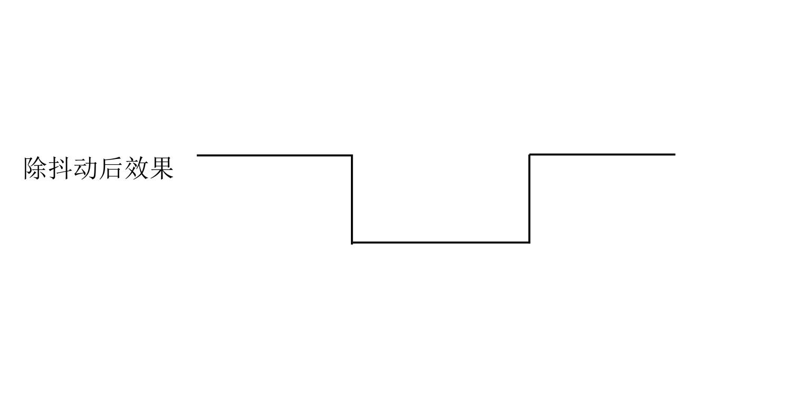  
4. 项目电路图和接线图：


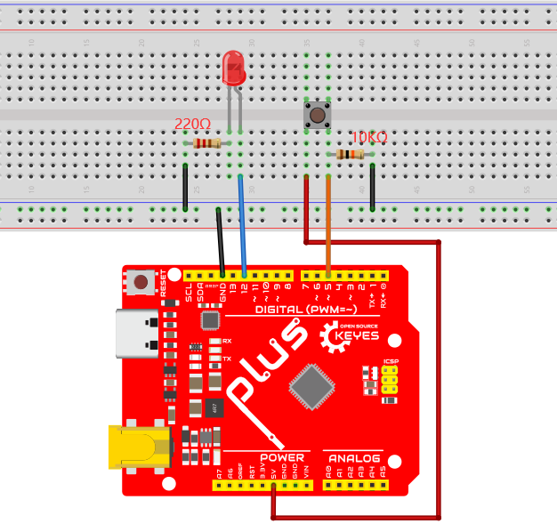

注意:

怎样连接LED


怎样识别五色环220Ω电阻和五色环10KΩ电阻


5. **项目代码：**

```cpp
/*
Keyes 2021入门学习套件
Project 13
Small_Desk_Lamp
http://www.keyes-robot.com
*/

int buttonPin = 5; // 按钮连接到数字5
int ledPin = 12; // LED连接到数字12
int ledState = LOW; // ledState记录当前LED状态（亮或灭）
int buttonState; // buttonState记录当前按键状态
int lastButtonState = LOW; // lastButtonState记录上一个按键状态
long lastDebounceTime = 0; // 上一次时间记录
long debounceDelay = 50; // 去抖延迟时间

void setup() {
    pinMode(buttonPin, INPUT); // 设置按钮引脚为输入
    pinMode(ledPin, OUTPUT); // 设置LED引脚为输出
    digitalWrite(ledPin, ledState); // 初始化LED状态
}

void loop() {
    // reading 用来存储 buttonPin 的数据
    int reading = digitalRead(buttonPin);

    // 一旦检测到数据发生变化，记录当前时间
    if (reading != lastButtonState) {
        lastDebounceTime = millis(); // 更新抖动时间
    }

    // 等待50ms，再进行一次判断，是否和当前 button 状态相同
    // 如果和目前状态不同，改变 button 状态
    // 如果 button 状态为高（也就是被按下），那么就改变 LED 的状态
    if ((millis() - lastDebounceTime) > debounceDelay) {
        if (reading != buttonState) {
            buttonState = reading; // 更新按钮状态
            if (buttonState == HIGH) {
                ledState = !ledState; // 切换 LED 状态
            }
        }
    }

    digitalWrite(ledPin, ledState); // 将 LED 状态设置为 ledState

    // 更新前一个按键状态值
    lastButtonState = reading;
}
```

6. 项目结果：

烧录好项目代码，按照接线图连接好线，上电后，按下按钮，灯点亮。再按下按钮，灯熄灭。是不是很像个小台灯？

### 项目14: 电子沙漏

1.  项目介绍：

古代人没有电子时钟，就发明了沙漏来测时间，沙漏两边的容量比较大，在一边装了细沙，中间有个很小的通道，将沙漏直立，有细沙的一边在上方，由于重力的作用，细沙就会往下流通过通道到沙漏的另一边，当细沙都流到下边了，就倒过来，把一天反复的次数记录下来，第二天就可以通过沙漏反复流动的次数而知道这一天大概的时间了。这一课我们将利用Plus     控制板控制倾斜开关和LED灯电子元件来模拟沙漏，制作一个电子沙漏。

2.  项目元件：

|||||
|-|-|-|-|
|Keyes Uno Plus 控制板*1|倾斜开关*1|红色 LED*4|10KΩ电阻*1|
|||||
|面包板*1|220Ω电阻*4|USB 线*1|跳线若干|

3.元件知识：


倾斜开关也叫数字开关。里面有一个可以滚动的金属球。采用金属球滚动与底部导电板接触的原理来控制电路的通断。当倾斜开关是滚珠型倾斜感应单方向性触发开关，当倾斜传感器向触发端（两根金属脚端）倾斜时，倾斜开关处于闭路状态，模拟端口的电压约为5V(二进制数为1023)。这样，LED会亮起。当倾斜开关在水平位置或向另一端倾斜时，倾斜开关处于开路状态，模拟端口的电压约为0V(0二进制)。LED将会关闭。在程序中，我们根据模拟端口的电压值，是否大于2.5V(512二进制)来判断开关是开还是关。

这里用倾斜开关的内部结构来说明它是如何工作的，显示如下图：


4.项目电路图和接线图：


注意:

怎样连接LED


怎样识别五色环220Ω电阻和五色环10KΩ电阻


5. **项目代码：**

```cpp
/*
Keyes 2021入门学习套件
Project 14
Electronic_Hourglass
http://www.keyes-robot.com
*/

const byte SWITCH_PIN = 4; // 将倾斜开关的引脚连接到数字D4
byte switch_state = 0; // 用于存储开关状态

void setup() {
    // 初始化引脚8到引脚11为输出，以控制LED
    for (int i = 8; i < 12; i++) {
        pinMode(i, OUTPUT);
    }
    // 初始化SWITCH_PIN为输入
    pinMode(SWITCH_PIN, INPUT);
    // 将引脚8到11设置为低电平
    for (int i = 8; i < 12; i++) {
        digitalWrite(i, 0);
    }
    // 初始化串行通讯，波特率设置为9600
    Serial.begin(9600);
}

void loop() {
    // 读取开关状态
    switch_state = digitalRead(SWITCH_PIN);
    // 将开关状态打印到串行监视器
    Serial.println(switch_state);

    // 如果开关处于闭合状态（倾斜状态）
    if (switch_state == 0) {
        // 点亮LED，模拟沙漏中的细沙流动
        for (int i = 8; i < 12; i++) {
            digitalWrite(i, 1); // 点亮当前LED
            delay(1000); // 延迟1秒
        }
    }

    // 如果开关处于打开状态（水平状态）
    if (switch_state == 1) {
        // 熄灭LED，模拟沙漏的另一边
        for (int i = 11; i > 7; i--) {
            digitalWrite(i, 0); // 熄灭当前LED
            delay(1000); // 延迟1秒
        }
    }
}
```

6.项目结果：

烧录好项目代码，按照接线图连接好线，上电后，用手握住面包板。倾斜到一定角度，led就会一个一个亮起来。当回到上一个角度时，led会一个一个关闭。就像沙漏一样，随着时间的推移，沙子漏了出来。

### 项目15: 人体红外传感器控制蜂鸣器

1.  项目介绍：

人体红外传感器测量运动物体发出的热的红外(IR)光。该传感器可以检测人、动物和汽车的运动，从而触发安全警报和照明。它们被用来检测移动，是安全的理想选择，如防盗警报和安全照明系统。在这个项目中，我们将使用人体红外传感器、蜂鸣器来检测有人或动物靠近时发出声音。

2.  项目元件：

|||||
|-|-|-|-|
|Keyes Uno Plus 控制板*1|传感器扩展板*1|人体红外传感器*1|面包板*1|
|||||
|有源蜂鸣器*1|3P 双头连接线*1|USB 线*1|跳线若干|

3.  元件知识：

人体红外传感器：其原理是某些晶体，例如钽酸锂、硫酸三甘肽等受热时，晶体两端会产生数量相等、符号相反的电荷，将这些电荷经放大器可转换为电压输出。而人体是会释放红外线的，虽然比较微弱，但是还是可以检测得到的。人体红外传感器检测附近有人运动时，传感器信号端输出高电平1，否则输出低电平0。特别注意，这个传感器可以检测在运动中的人、动物和汽车，静止中的人、动物和汽车是检测不到的，检测最远距离大约为7米左右。

注意：人体红外传感器应避开日光、汽车头灯、白炽灯直接照射，也不能对着热源(如暖气片、加热器)或空调，以避免环境温度较大的变化而造成误报。同时还易受射频辐射的干扰。

传感器技术参数：

最大输入电压：DC 3.3 ~ 5 v

最大工作电流：50MA

最大功率：0.3W

工作温度：-20 ~ 85℃

输出高电平3V，低电平0 V

延迟时间：大约2.3到3秒钟

检测角度：大约100度

检测最远距离：大约 7米左右

指示灯输出(当输出高电平时，它将点亮)

引脚限制电流：50MA

传感器原理图：


传感器扩展板：当我们在做DIY实验时，我们经常会利用UNO R3控制板和其他传感器/模块搭配使用。为了方便接线，我们的最新一版传感器/模块使用了间距为2.54mm防反接口。为了兼容最新一版传感器/模块接口，我们特别设计了这一款扩展板。使用时，我们只需要将扩展板堆叠在UNO R3控制板上，利用一个特定接线连接传感器/模块。接线简单方便，由于是防反接口，线序固定，将不会再出现控制板连接传感器/模块时，因线序接反，导致烧坏传感器/模块现象。

为方便接线，扩展板上接口都带有丝印。3pin接口丝印一般为G V S，其中扩展板上所有的G代表GND，V代表VCC（5V）接口，S代表接口上方的数字口/模拟口。4pin/5pin接口左面都有对应接口丝印。扩展板上两边还自带间距为2.54mm的排母接口，接线顺序和UNO R3板的排母接口的线序一致。同时扩展板上自带一个复位按键，1个复位按键指示灯（D2）,1个电源指示灯（D1）。

为了方便将扩展板固定在其他设备，扩展板只带两个直径为3mm的定位孔大小。

扩展板规格参数：

兼容：UNO R3控制板

接口：间距为2.54mm 3pin防反接口

定位孔大小：直径为3mm

尺寸：68\*55\*21mm

重量：26g

传感器扩展板接口说明：


4.  项目电路图和接线图：


5. **项目代码：**

```cpp
/*
Keyes 2021入门学习套件
Project 15
PIR_control_buzzer
http://www.keyes-robot.com
*/

int buzzerpin = 8; // 定义蜂鸣器引脚为数字8
int pirPin = 3; // 定义人体红外传感器引脚为数字3
int pirStat = 0; // 用于存储人体红外传感器的状态

void setup() {
    pinMode(buzzerpin, OUTPUT); // 设置蜂鸣器引脚为输出
    pinMode(pirPin, INPUT); // 设置人体红外传感器引脚为输入
    Serial.begin(9600); // 初始化串行监视器，波特率为9600
}

void loop() {
    // 读取人体红外传感器的状态
    pirStat = digitalRead(pirPin);

    if (pirStat == HIGH) { // 如果传感器检测到运动
        digitalWrite(buzzerpin, HIGH); // 打开蜂鸣器
        Serial.println("Hey I got you!!!"); // 向串行监视器打印信息
    } 
    else {
        digitalWrite(buzzerpin, LOW); // 如果未检测到运动，关闭蜂鸣器
    }
}
```

6.  项目结果：

烧录好项目代码，按照接线图连接好线，上电后，如果PIR红外传感器检测到附近有人移动，蜂鸣器就会发出警报，点击打开Arduino IDE上的串行监视器，你会看到“Hey I got you!!”。

### 项目16： I2C 1602 LCD

1.项目介绍：

在生活中，我们可以利用显示器等模块来做各种实验。你也可以DIY各种各样的小物件。例如，用一个温度传感器和显示器做一个温度测试仪，或者用一个超声波模块和显示器做一个距离测试仪。下面，我们将使用1602 I2C模块作为显示器，将其连接到Plus控制板上。将使用Plus控制板控制1602显示屏显示字符串。

||||||
|Keyes Uno Plus 控制板*1|传感器扩展板*1|I2C 1602 LCD*1|4P 双头连接线*1|USB 线*1|

2.项目元件：

3.元件知识：


LCD1602显示屏：显示屏有LCD 1602液晶显示屏和I2C 1602 LCD。但是我们在这个项目中使用的是一个I2C LCD 1602。LCD 1602显示屏可以显示16列2行字符。它能够显示数字、字母、符号、ASCII码等。如下所示是一个单色LCD1602显示屏（在工作时需要占用控制板的7个IO口）及其电路引脚图：

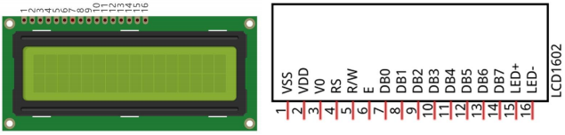

I2C LCD1602显示屏集成了I2C接口，连接的串行输入&并行输出给LCD1602显示屏模块。这使得我们只要使用4条线路就可以来操作LCD1602。

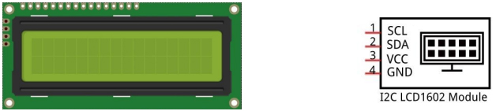

本模块使用的IC芯片为PCF8574T (PCF8574AT)，其默认I2C地址为0x27(0x3F)。

在液晶显示器的背面有一个金属电位器。你可以用螺丝刀（我们不提供，你们自备）转动电位器来调整对比度。


请注意：当你旋转电位器时，屏幕将变得更亮或更暗，适当的角度将使字体更清晰。

I2C 1602 LCD 原理图：


I2C 1602 LCD技术参数：

显示像素：16 \* 2 字符

芯片工作电压：4.5 ~ 5.5V

工作电流：2.0mA (5.0V)

模块最佳工作电压：5.0V

I2C 地址：0x27

背光 (蓝色背景和白色背光)

4.项目接线图：


5.  项目代码：

注意：代码中需要安装库文件，如果已经添加了LiquidCrystal_I2C和Wire等库文件，就忽略下面库文件的添加过程。

将文件夹中的库文件解压，即把解压后的LiquidCrystal_I2C文件夹和Wire文件夹放入编译器安装目录下的\Arduino\libraries里。

放置成功后，需要重启编译器，不然编译不过。

例如我的：C:\Program Files\Arduino\libraries


```cpp
/*
Keyes 2021入门学习套件
Project 16
I2C 1602 LCD
http://www.keyes-robot.com
*/

#include <Wire.h> // 包含I2C库
#include <LiquidCrystal_I2C.h> // 包含I2C液晶控制库

// 创建一个LiquidCrystal_I2C对象，指定LCD地址为0x27，16列2行
LiquidCrystal_I2C lcd(0x27, 16, 2);

void setup() {
    lcd.init(); // 初始化LCD
    lcd.backlight(); // 打开LCD背光
}

void loop() {
    lcd.setCursor(3, 0); // 设置光标到第1行第4列
    lcd.print("Hello, world!"); // 显示文本
    lcd.setCursor(2, 1); // 设置光标到第2行第3列
    lcd.print("keyestudio!"); // 显示文本
}
```

6.项目结果：

烧录好项目代码，按照接线图连接好线，上电后，I2C 1602 LCD的第一行将显示Hello, world!，第二行将显示keyestudio
!。通过更改我们提供的代码括号中的文本并再次上传代码，你可以通过I2C 1602 LCD看到显示的东西。

lcd.setCursor(3,0);

lcd.print("Hello, world!");

lcd.setCursor(2,1);

lcd.print("keyestudio!");

### 项目17：小风扇

1.  项目介绍：

在炎热的夏季，需要电扇来给我们降温，那么在这个项目中，我们将使用Plus控制板控制直流电机来制作一个小电扇。

2.  项目元件：

||||||||
|-|-|-|-|-|-|-|
|Keyes Uno Plus 控制板*1|L293D芯片*1|直流电机*1|面包板*1|USB 线*1|跳线若干|风扇片*1|

3.元件知识:


L293D芯片：L293D是一种直流电动驱动IC，在一些机器人项目中可用来驱动直流电机或步进电机。它共有16个引脚，可以同时驱动两路直流电机。输入电压范围：4.5 V ~ 36 V，每通道输出电流：MAX 600mA，可以驱动感性负载，特别是其输入端可以与单片机直接相连，从而很方便地受单片机控制。当驱动小型直流电机时，可以直接控制两路电机，并且可以实现电机正转与反转，实现此功能只需改变输入端的高低电平。市面上有许多采用L293D芯片的电机驱动板，当然我们也可以自己通过简单连接来使用它。

L293D引脚图：


|引脚号|引脚名称|描述|
|-|-|-|
|1|Enable1|该引脚使能输入引脚Input 1(2)和Input 2(7)|
|2|In1|直接控制输出1引脚，由数字电路控制。|
|3|Out1|连接到电机1的一端|
|4|0V|接地引脚连接到电路的接地(0V)|
|5|0V|接地引脚连接到电路的接地(0V)|
|6|Out2|连接到电机1的另一端|
|7|In2|直接控制输出2引脚。由数字电路控制|
|8|+V motor|连接到运行电机的电压引脚(4.5V至36V)|
|9|Enable2|该引脚使能输入引脚输入3(10)和输入4(15)|
|10|In3|直接控制输出3引脚。由数字电路控制|
|11|Out3|连接到电机2的一端|
|12|0V|接地引脚连接到电路的接地(0V)|
|13|0V|接地引脚连接到电路的接地(0V)|
|14|Out4|连接到电机2的另一端|
|15|In4|直接控制输出4引脚，由数字电路控制|
|16|+V|连接到+ 5V以启用IC功能|

4.项目电路图和接线图：


5.  项目代码：


```cpp
/*
Keyes 2021入门学习套件
Project 17
Small_Fan
http://www.keyes-robot.com
*/

// 定义控制引脚
int IN1 = 8; // 控制正转的引脚
int IN2 = 4; // 控制反转的引脚
int ENA = 9; // 速度控制PWM引脚

void setup() {
    pinMode(IN1, OUTPUT); // 设置IN1为输出模式
    pinMode(IN2, OUTPUT); // 设置IN2为输出模式
    pinMode(ENA, OUTPUT); // 设置ENA为输出模式
}

void loop() {
    // 向前转（正转）
    digitalWrite(IN1, LOW);  // 设置IN1为低电平
    digitalWrite(IN2, HIGH); // 设置IN2为高电平
    analogWrite(ENA, 200);   // 设置电机速度为200
    delay(3000);             // 运行3秒

    analogWrite(ENA, 0);     // 停止电机
    delay(1000);             // 延迟1秒

    // 向后转（反转）
    digitalWrite(IN1, HIGH); // 设置IN1为高电平
    digitalWrite(IN2, LOW);  // 设置IN2为低电平
    analogWrite(ENA, 100);   // 设置电机速度为100
    delay(3000);             // 运行3秒

    analogWrite(ENA, 0);     // 停止电机
    delay(1000);             // 延迟1秒
}
```

6.项目结果：

在控制板上上传代码成功，按照接线图接好线，并且把小风扇安装到电机上，上电后，可以看到小风扇向前旋转3秒，停止1秒，反转3秒，停止1秒，重复进行。ENA连接到Plus控制板的PWM引脚。可以通过控制PWM来控制小风扇的速度。在实验中，正向旋转速度明显快于反向旋转速度。

### 项目18: 舵机转动

1.  项目介绍：

舵机是一种可以非常精确地旋转的电机。目前已广泛应用于玩具车、遥控直升机、飞机、机器人等领域。在这个项目中，我们将使用Plus
控制板控制舵机转动。

2.  项目元件：

|||||
|-|-|-|-|
|Keyes Uno Plus 控制板*1|传感器扩展板*1|舵机*1|USB 线*1|

3.  元件知识：

舵机：


舵机是一种位置伺服的驱动器，主要是由外壳、电路板、无核心马达、齿轮与位置检测器所构成。其工作原理是由接收机或者单片机发出信号给舵机，其内部有一个基准电路，产生周期为20ms，宽度为1.5ms
的基准信号，将获得的直流偏置电压与电位器的电压比较，获得电压差输出。经由电路板上的IC
判断转动方向，再驱动无核心马达开始转动，透过减速齿轮将动力传至摆臂，同时由位置检测器送回信号，判断是否已经到达定位。适用于那些需要角度不断变化并可以保持的控制系统。当电机转速一定时，通过级联减速齿轮带动电位器旋转，使得电压差为0，电机停止转动。一般舵机旋转的角度范围是0度到180
度。

控制舵机的脉冲周期为20ms，脉冲宽度为0.5ms ~ 2.5ms，对应位置为-90°~
+90°。下面是以一个180°角的舵机为例：


伺服电机有多种规格，但它们都有三根连接线，分别是棕色、红色、橙色(不同品牌可能有不同的颜色)。棕色为GND，红色为电源正极，橙色为信号线。

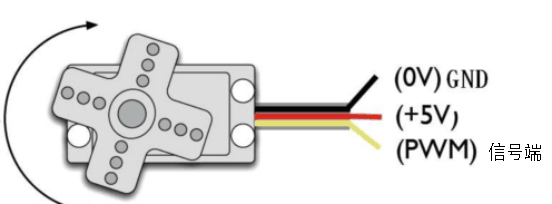

4.  项目接线图：


5.  项目代码：

注意：代码中需要安装库文件，如果已经添加了Servo库文件，就忽略下面库文件的添加过程。

将文件夹中的库文件解压，即把解压后的Servo文件夹放入编译器安装目录下的\Arduino\libraries里。

放置成功后，需要重启编译器，不然编译不过。

例如我的：C:\Program Files\Arduino\libraries


```cpp
/*
Keyes 2021入门学习套件
Project 18
Steering_gear_rotating
http://www.keyes-robot.com
*/

#include <Servo.h> // 引入舵机控制库

Servo myservo; // 定义舵机实例

void setup() {
    myservo.attach(9); // 将舵机连接到引脚9
}

void loop() {
    myservo.write(0);  // 将舵机转动到0度
    delay(500);        // 等待500毫秒

    myservo.write(45); // 将舵机转动到45度
    delay(500);        // 等待500毫秒

    myservo.write(90); // 将舵机转动到90度
    delay(500);        // 等待500毫秒

    myservo.write(135);// 将舵机转动到135度
    delay(500);        // 等待500毫秒

    myservo.write(180);// 将舵机转动到180度
    delay(500);        // 等待500毫秒
}
```


6. 项目结果：

将项目代码上传到Plus控制板。按照接线图接好线，上电后，舵机塑料臂将以0°、45°、90°、135°、180°的角度转动。循环进行！！

### 项目19：步进电机 

1.  项目介绍：

步进电机定位准确，是工业机器人、3D打印机、大型车床等机械设备中最重要的部件。在这个项目中，我们将使用
Plus 控制板控制一个步进电机转动。

2.  项目元件：

||||||
|-|-|-|-|-|
|Keyes Uno Plus 控制板*1|ULN2003步进电机驱动板*1|步进电机*1|公对母杜邦线若干|USB 线*1|

3.  项目知识：


步进电机：是由一系列电磁线圈控制的电机。它可以根据需要旋转精确的度数(或步数)，允许你将它移动到一个精确的位置并保持该位置。它是通过在很短的时间内为电机内部的线圈供电来做到这一点的，但你必须一直为电机供电，以保持它在你想要的位置。有两种基本类型的步进电机，单极步进和双极步进。在本项目中，我们使用的是单极步进电机28-BYJ48。


28BYJ-48步进电机工作原理：

步进电机主要由定子和转子组成，定子是固定不动的，如下图绕着A、B、C、D线圈组的部分，线圈组导通电就会产生磁场；转子就是转动的部分，如下图定子中间的部分，两极是永磁铁。


单步4节拍的转动原理：开始A组线圈导通，转子两极正对着A组线圈；接着A组线圈断开，B组线圈导通，转子就会顺时针转到B组线圈，转子转了一步；B断开，C导通，转子转到C组；C断开，D导通，转子转到D组；D组断开，A组导通，转子转到A组线圈。这样转子就转了半圈180度，接着再重复一次，B-C-D-A，转子转回到A组线圈，这样转子就转了一圈，总共转动了8步。如下图所示，这就是步进电机单节拍转动的原理A -
B - C - D - A ....。

如果想让步进电机逆时针转动，那只要把节拍顺序反过来就行，D - C - B - A -
D .....。


半步8节拍转动原理：8节拍，采用的是单双拍的形式，A - AB - B - BC - C -
CD - D - DA - A ......
，这样运转一拍，转子只会转动半步，例如，A组线圈导通，转子转到正对着A组线圈；接着A和B组一起导通，这样产生的磁场最强的地方在AB组线圈中间，转子两极就会转到AB组线圈中间，也就是顺时针转了半步。

步进电机参数：

我们所提供的步进电机需要转动32步，转子才能转一圈，还经过了1:64的减速齿轮组带动输出轴，这样输出轴转动一圈需要：
32 \* 64 = 2048 步。

电压5V，4相步进电机 ，4节拍模式的步进角为11.25，
8节拍模式步进角为5.625， 减速比为1:64

ULN2003步进电机驱动板：是步进电机驱动器。

下面的原理图显示了如何使用ULN2003步进电机驱动板接口将一个单极步进电机接到Plus控制板的引脚上，并显示了如何使用四个TIP120的接口。


4.  项目原理图和接线图：


5.项目代码：

```cpp
/*
Keyes 2021入门学习套件
Project 19
Stepper_motor
http://www.keyes-robot.com
*/

// 步进电机引脚定义
const int IN1_pin = 11; // 步进电机引脚1
const int IN2_pin = 10; // 步进电机引脚2
const int IN3_pin = 9;  // 步进电机引脚3
const int IN4_pin = 8;  // 步进电机引脚4

int val; // 用于存储从串行端口读取的值

void setup() {
    Serial.begin(9600); // 初始化串行通信，波特率为9600

    // 设置步进电机引脚为输出
    pinMode(IN1_pin, OUTPUT);
    pinMode(IN2_pin, OUTPUT);
    pinMode(IN3_pin, OUTPUT);
    pinMode(IN4_pin, OUTPUT);
}

void loop() {
    int a = 1024;  // 正向旋转步数
    int b = 1024;  // 反向旋转步数

    val = Serial.read(); // 读取串行端口的数据

    // 如果接收到'A'字符，执行正向旋转
    if (val == 'A') {
        while (a--) {
            digitalWrite(IN1_pin, HIGH);
            digitalWrite(IN2_pin, LOW);
            digitalWrite(IN3_pin, LOW);
            digitalWrite(IN4_pin, LOW);
            delay(10); // 延迟10毫秒

            digitalWrite(IN1_pin, LOW);
            digitalWrite(IN2_pin, HIGH);
            digitalWrite(IN3_pin, LOW);
            digitalWrite(IN4_pin, LOW);
            delay(10); // 延迟10毫秒

            digitalWrite(IN1_pin, LOW);
            digitalWrite(IN2_pin, LOW);
            digitalWrite(IN3_pin, HIGH);
            digitalWrite(IN4_pin, LOW);
            delay(10); // 延迟10毫秒

            digitalWrite(IN1_pin, LOW);
            digitalWrite(IN2_pin, LOW);
            digitalWrite(IN3_pin, LOW);
            digitalWrite(IN4_pin, HIGH);
            delay(10); // 延迟10毫秒
        }
    }

    // 如果接收到'C'字符，执行反向旋转
    if (val == 'C') {
        while (b--) {
            digitalWrite(IN4_pin, HIGH);
            digitalWrite(IN3_pin, LOW);
            digitalWrite(IN2_pin, LOW);
            digitalWrite(IN1_pin, LOW);
            delay(10); // 延迟10毫秒

            digitalWrite(IN4_pin, LOW);
            digitalWrite(IN3_pin, HIGH);
            digitalWrite(IN2_pin, LOW);
            digitalWrite(IN1_pin, LOW);
            delay(10); // 延迟10毫秒

            digitalWrite(IN4_pin, LOW);
            digitalWrite(IN3_pin, LOW);
            digitalWrite(IN2_pin, HIGH);
            digitalWrite(IN1_pin, LOW);
            delay(10); // 延迟10毫秒

            digitalWrite(IN4_pin, LOW);
            digitalWrite(IN3_pin, LOW);
            digitalWrite(IN2_pin, LOW);
            digitalWrite(IN1_pin, HIGH);
            delay(10); // 延迟10毫秒
        }
    }

    // 确保步进电机停止
    digitalWrite(IN4_pin, LOW);
    digitalWrite(IN3_pin, LOW);
    digitalWrite(IN2_pin, LOW);
    digitalWrite(IN1_pin, LOW);
}
```

6.项目结果：

将项目代码上传到PLUS开发板，按接线图接好线，上电后，打开串口监视器，设置波特率为9600，我们在串口监视器中输入“A”并点击“发送”，步进电机是反转，在串口监视器中输入“C”并点击“发送”，步进电机是正转。

### 项目20：继电器 

项目介绍：

在日常生活中，我们一般使用220V交流来驱动电气设备，有时我们会用开关来控制电器。如果将开关直接连接到220V交流电路上，一旦发生漏电，人就有危险。从安全的角度考虑，我们特别设计了这款具有NO(常开)端和NC(常闭)端的继电器模块。在这节课我们将学习一个比较特殊，好用的开关，就是继电器模块。

项目元件：

|||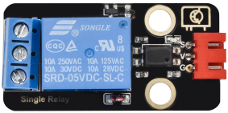|||
|-|-|-|-|-|
|Keyes Uno Plus 控制板*1|传感器扩展板*1|继电器模块*1|3P 双头连接线*1|USB 线*1|

元件知识：

继电器：是用小电流去控制大电流运作的一种“自动开关”。

控制输入电压：5V

额定负载：5A 250VAC (NO/NC) 5A 24VDC (NO/NC)

额定负载的意思是，可以使用树莓派的5V控制直流电压24V或者交流电压250V的设备。

继电器原理图：


项目接线图：


项目代码：


```cpp
/*
Keyes 2021入门学习套件
Project 20
Relay
http://www.keyes-robot.com
*/

int Relay = 3; // 定义数字口3

void setup() {
    pinMode(Relay, OUTPUT); // 将Relay设置为输出
}

void loop() {
    digitalWrite(Relay, HIGH); // 打开继电器
    delay(2000); // 延时2秒
    digitalWrite(Relay, LOW); // 关闭继电器
    delay(2000); // 延时2秒
}
```

项目结果：

在控制板上上传代码成功，按照接线图接好线，上电后，继电器开启（ON端连通）2秒，停止（NC端连通）2秒，循环交替。开启时继电器上的LED亮起。

### 项目21：调光灯

1.  项目介绍：

电位器是一个带有滑动或旋转触点的三端电阻器，它形成一个可调的分压器。它的工作原理是在均匀电阻上改变滑动触点的位置。在电位器中，整个输入电压被施加到电阻的整个长度上，输出电压是固定触点和滑动触点之间的电压值。在这个项目中，我们将学习如何使用Arduino读取电位器的值，并制作一个可调光灯。

2.  项目元件：

|||||
|-|-|-|-|
|Keyes Uno Plus 控制板*1|可调电位器*1|红色 LED*1|200Ω电阻*1|
|||||
|面包板*1|USB 线*1|跳线若干||

3.  元件知识：


可调电位器：可调电位器是电阻和模拟电子元件的一种，具有0和1两种状态(高电平和低电平)。模拟量不同，其数据状态呈现为1
~ 1024等线性状态。

4.  读取电位器模拟值：

我们将可调电位器连接到Arduino的模拟引脚上读取其值。接线请参照以下接线图：


```cpp
/*
Keyes 2021入门学习套件
Project 21.1
Read_the_adjustable_potentiometer_analog_value
http://www.keyes-robot.com
*/

int potpin = A1; // 初始化可调电位器的模拟引脚A1
int val = 0;     // 定义val，初始值赋为0

void setup() {
    Serial.begin(9600); // 波特率设置为9600
}

void loop() {
    val = analogRead(potpin); // 读取模拟引脚A1的模拟值，并将其赋值给val
    Serial.println(val);       // 显示val的值
}
```


将代码上传到Plus控制板上，按照接线图连接好线，上电后，当你旋转电位器旋钮时，你可以看到显示的值发生变化。由于大多数传感器输出的是模拟值，因此模拟值的读取是一个非常常见的功能。经过计算，可以得到所需的对应值。下图显示了它读取的模拟值。


5.调光灯的电路图和接线图：

在前面一步，我们读取了可调电位器的模拟值，现在我们需要将电位器的模拟值转换成LED的亮度，做成一个亮度可调的灯。见接线图。


6.项目代码：


```cpp
/*
Keyes 2021入门学习套件
Project 21.2
Dimming_light
http://www.keyes-robot.com
*/

int potpin = A1; // 初始化可调电位器的模拟引脚A1
int ledpin = 11; // 初始化数字引脚11
int val = 0;     // 定义val，初始值赋为0

void setup() {
    pinMode(ledpin, OUTPUT); // 设置数字引脚为“输出”
    Serial.begin(9600);      // 波特率设置为9600
}

void loop() {
    val = analogRead(potpin);       // 读取模拟引脚A1的模拟值，并将其赋值给val
    analogWrite(ledpin, val / 4);    // 根据电位器的值来调节LED亮度
    Serial.println(val);              // 显示val的值
}
```


7.项目结果：

在控制板上上传代码成功，按照接线图接好线，上电后，打开串口监视器，设置波特率为9600，监视器将显示电位器的模拟值。当我们转动电位器时，LED的亮度会发生变化。

### 项目22: 火焰报警

1.  项目介绍：

火灾是一种可怕的灾害，火灾报警系统在房屋，商业建筑和工厂中非常有用。在本项目中，我们将使用火焰传感器和蜂鸣器来制作火灾报警装置。这是一个有意义的创客活动。

2.  项目元件：

||||||||
|-|-|-|-|-|-|-|
|Keyes Uno Plus 控制板*1|火焰传感器*1|有源蜂鸣器*1|面包板*1|跳线若干|USB 线*1|10KΩ电阻*1|

3.  元件知识：


火焰会发出一定程度的IR光，这种光人眼是看不到的，但我们的火焰传感器可以检测到它，并提醒微控制器，如Arduino已经检测到火灾。它有一个专门设计的红外接收管来探测火焰，然后将火焰亮度转换为波动水平信号。接收三极管的短引脚是负极，另一个长引脚是正极。我们应该连接短引脚（负极)到5V，连接长
引脚(正极)到模拟引脚，一个电阻和GND。如下图所示：


4.  读取火焰传感器模拟值：

我们首先用一个简单的代码读取火焰传感器的值，把它打印在串行监视器上。接线请参照以下接线图：

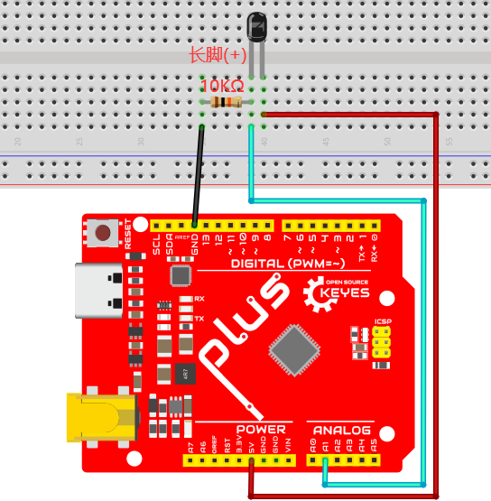


```cpp
/*
Keyes 2021入门学习套件
Project 22.1
Read_the_flame_sensor_analog_value
http://www.keyes-robot.com
*/

int flamepin = A1; // 初始化模拟管脚A1
int val = 0;       // 定义val，初始值赋为0

void setup() {
    Serial.begin(9600); // 波特率设置为9600
}

void loop() {
    val = analogRead(flamepin); // 读取模拟引脚A1的模拟值，并将其值赋给val
    Serial.println(val);         // 显示val值
}
```


将代码上传到Plus控制板，按照接线图连接好线，上电后。打开串行监视器，用打火机火焰接近火焰传感器查看其模拟值。


5.  火焰报警的电路图和接线图：

接下来，我们将使用火焰传感器和蜂鸣器、RGB LED制作一个有趣的项目——火焰报警。当检测到火焰时，RGB亮红灯，蜂鸣器报警。


6.  项目代码：


```cpp
/*
Keyes 2021入门学习套件
Project 22.2
Fire_alarm
http://www.keyes-robot.com
*/

const int red = 11;          // 红色LED引脚
const int green = 10;       // 绿色LED引脚
const int blue = 9;         // 蓝色LED引脚
const int buzzer = 12;      // 蜂鸣器引脚
const int flamepin = A1;    // 火焰传感器引脚
const int thereshold = 30;  // 阈值

void setup() {
    // 将设置代码放在这里，运行一次:
    Serial.begin(9600);
    pinMode(red, OUTPUT);
    pinMode(green, OUTPUT);
    pinMode(blue, OUTPUT);
    pinMode(buzzer, OUTPUT);
    pinMode(flamepin, INPUT);
}

void setColor(int redValue, int greenValue, int blueValue) {
    analogWrite(red, redValue);
    analogWrite(green, greenValue);
    analogWrite(blue, blueValue);
}

void loop() {
    // 把主代码放在这里，重复运行:
    int flamesenseval = analogRead(flamepin);
    Serial.println(flamesenseval);

    if (flamesenseval >= thereshold) {
        setColor(255, 0, 0); // 红色
        tone(buzzer, 1000);
        delay(10);
    } else {
        setColor(0, 255, 0); // 绿色
        noTone(buzzer);
    }
}
```


7.项目结果：

将代码上传到PLUS控制板，按照接线图连接好线，上电后。打开串口监视器，设置波特率为9600，监视器将显示火焰传感器的值。我们使用打火机火焰靠近火焰传感器，RGB LED亮红灯，蜂鸣器会报警；否则RGB LED亮绿灯，蜂鸣器不响。

### 项目23: 光控灯

1.项目介绍：

传感器或元件在我们的日常生活中是无处不在的。例如，一些公共路灯在晚上会自动亮起，而在白天会自动熄灭。为什么呢?
事实上，这些都是利用了一种光敏元件，可以感应外部环境光强度的元件。晚上，当室外亮度降低时，路灯会自动打开；到了白天，路灯会自动关闭。这其中的原理是很简单的，这节课我们就实现这个路灯的功能。

2.  项目元件：

|||||
|-|-|-|-|
|Keyes Uno Plus 控制板*1|光敏电阻*1|红色 LED*1|220Ω电阻*1|
|||||
|10KΩ电阻*1|面包板*1|跳线若干|USB 线*1|

3.  元件知识：


光敏电阻：光敏传感器是利用半导体的光电导效应制成的一种电阻值随入射光的强弱而改变的电阻器，又称为光电导探测器。周围的光变强，电阻变小，模拟信号就变大；反之，光变弱，电阻增大，模拟信号就变小。

光敏传感器常用的制作材料为硫化镉，另外还有硒、硫化铝、硫化铅和硫化铋等材料。这些制作材料具有在特定波长的光照射下，其阻值迅速减小的特性。这是由于光照产生的载流子都参与导电，在外加电场的作用下作漂移运动，电子奔向电源的正极，空穴奔向电源的负极，从而使光敏传感器的阻值迅速下降。

光敏电阻普遍应用于光的测量、光的控制和光伏转换(将光的变化转化为电能的变化)。光敏电阻也被广泛应用于各种光控电路，如光控调节、光开关等。


我们将从一个相对简单的关于光敏变阻器应用的实验开始。

4.  读取光敏电阻模拟值：

我们首先用一个简单的代码读取光电池的值，将其打印在串行监视器中。接线请参照以下接线图：


```cpp
/*
Keyes 2021入门学习套件
Project 23.1
Read_the_photosensitive_resistance_analog_value
http://www.keyes-robot.com
*/

int photocellpin = A0; // 初始化连接光敏电阻的模拟管脚A0
int val = 0;           // 初始化变量val的值为0

void setup() {
    Serial.begin(9600); // 波特率设置为9600
}

void loop() {
    val = analogRead(photocellpin); // 读取传感器的值并将其值赋给val
    Serial.println(val);             // 显示val的值
    delay(200);                      // 等待0.2秒
}
```


将代码上传到Plus控制板上，按照接线图连接好线，上电后，打开串口显示器，就可以读取光敏电阻的模拟值。逐渐减弱光敏电阻所处环境中的光照强度，你会发现串口显示器上显示的模拟值在逐渐变小了；反之，模拟值在逐渐增大。


5.  光控灯的电路图和接线图：

我们在前面做了一个小的调光灯，现在我们做一个光控灯。它们的原理是相同的。即通过Arduino获取传感器的模拟值，然后调节LED的亮度。


6.  项目代码：


```cpp
/*
Keyes 2021入门学习套件
Project 23.2
Light_lamp
http://www.keyes-robot.com
*/

int photocellpin = A0; // 初始化连接光敏电阻的模拟管脚A0
int ledpin = 11;       // 初始化数字管脚11
int val = 0;           // 初始化变量val的值为0

void setup() {
    pinMode(ledpin, OUTPUT); // 设置数字引脚11为“输出”
    Serial.begin(9600);      // 波特率设置为9600
}

void loop() {
    val = analogRead(photocellpin); // 读取传感器的模拟值并将其值赋给val
    Serial.println(val);             // 显示val的值
    analogWrite(ledpin, val / 4);    // 设置亮度(最大值255)
    delay(10);                       // 等待0.01秒
}
```


7.  项目结果：

将代码上传到PLUS控制板。按照接线图连接好线，上电后，打开串口显示器，设置波特率为9600。监视器将显示光敏电阻的模拟值。当逐渐减弱光敏电阻所处环境中的光照强度时，串口显示器上显示的模拟值在逐渐变小，LED会变暗。当逐渐减强光敏电阻所处环境中的光照强度时，显示的模拟值会变大，LED会变亮。

### 项目24: 超声波测距仪

1.  项目介绍：       HC-SR04超声波传感器是一种非常实惠的距离传感器，主要用于各种机器人项目中的物体躲避。它也被用于水位传感，甚至作为一个停车传感器。我们把超声波传感器当作蝙蝠的眼睛。在黑暗中，蝙蝠仍然可以通过超声波识别前方的物体和方向。

2.  项目元件：

||||||
|-|-|-|-|-|
|Keyes Uno Plus 控制板*1|传感器扩展板*1|超声波传感器*1|红色LED*4|220Ω电阻*4|
||||||
|4P双头连接线*1|USB 线*1|面包板*1|跳线若干||

3.  元件知识：

HC-SR04超声波传感器：像蝙蝠一样使用声纳来确定与物体的距离，它提供了精准的非接触范围检测，高精度和稳定的读数。它的操作不受阳光或黑色材料的影响，就像精密的照相机(在声学上像布料这样比较软的材料很难被探测到)。它带有超声波发射器和接收器。

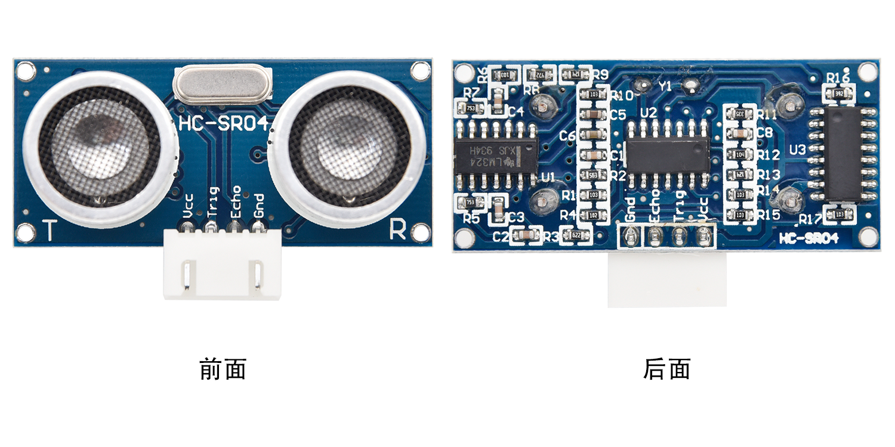

在超声波传感器的前面是两个金属圆筒，这些是转换器。转换器将机械能转换成电信号。在超声波传感器中，有发射转换器和接收转换器。发射转换器将电信号转换为超声波脉冲，接收转换器将反射的超声波脉冲转换回电信号。如果你看超声波传感器的背面，你会看到的发射转换器后面有一个IC。这是控制发射转换器的IC。在接收转换器后面也有一个IC，这是一个四运算放大器，它将接收转换器产生的信号放大成足以传输到Arduino的信号。

时序图：

图示HC-SR04的时序图。为了开始测量，SR04的Trig必须接受至少10us的高(5V)脉冲，这将启动传感器将发射出8个周期的40kHz的超声波脉冲，并等待反射的超声波脉冲。当传感器从接收器检测到超声波时，它将设置回波引脚为高(5V)和延迟一个周期(宽度)，与距离成比例。为了获得距离，测量Echo引脚的宽度。


时间=回波脉冲宽度，单位为us(微秒)

距离厘米=时间/ 58

距离(英寸)=时间/ 148

4.  读取超声波传感器距离值

我们将从一个简单的超声波测距开始，在串行监视器里输出测量的距离。


HC-SR04超声波传感器有四个引脚：Vcc、Trig、Echo和GND。Vcc引脚提供产生超声波脉冲的电源，接Vcc/+5V。GND引脚接地/GND。Trig引脚是Arduino发送信号来启动超声波脉冲的地方。Echo引脚是超声波传感器向Plus控制板发送关于超声波脉冲行程持续时间的信息的地方。按下图接线：


```cpp
/*
Keyes 2021入门学习套件
Project 24.1
Read_the_ultrasonic_distance
http://www.keyes-robot.com
*/

const int trig = 12; // 超声波触发引脚
const int echo = 13; // 超声波回声引脚
int duration = 0;    // 持续时间
int distance = 0;    // 距离

void setup() {
    pinMode(trig, OUTPUT); // 设置触发引脚为输出
    pinMode(echo, INPUT);  // 设置回声引脚为输入
    Serial.begin(9600);    // 波特率设置为9600
}

void loop() {
    digitalWrite(trig, HIGH);           // 发送触发信号
    delayMicroseconds(1000);            // 延时1毫秒
    digitalWrite(trig, LOW);            // 关闭触发信号
    duration = pulseIn(echo, HIGH);     // 读取回声信号持续时间
    distance = (duration / 2) / 28.5;   // 计算距离
    Serial.print(distance);              // 输出距离
    Serial.println("cm");                 // 输出单位
}
```

上传好代码到Plus控制板，按接线图接好线，上电后，再打开串行监视器，设置波特率为9600，当把一个物体放在超声波传感器前面时(远近)，它会检测到物体的距离，该值将显示在监视器上。


5.  超声波测距仪的电路图和接线图：

接下来，我们将使用超声波传感器和4个led制作一个简单的超声波测距仪。按下图接好线。


6.  项目代码：


```cpp
/*
Keyes 2021入门学习套件
Project 24.2
Ultrasonic_range_finder
http://www.keyes-robot.com
*/

const int trig = 12;  // 超声波触发引脚
const int echo = 13;  // 超声波回声引脚
const int LED1 = 11;  // LED1引脚
const int LED2 = 10;  // LED2引脚
const int LED3 = 9;   // LED3引脚
const int LED4 = 8;   // LED4引脚
int duration = 0;     // 持续时间
int distance = 0;     // 距离

void setup() {
    pinMode(trig, OUTPUT); // 设置触发引脚为输出
    pinMode(echo, INPUT);  // 设置回声引脚为输入
    pinMode(LED1, OUTPUT); // 设置LED引脚为输出
    pinMode(LED2, OUTPUT);
    pinMode(LED3, OUTPUT);
    pinMode(LED4, OUTPUT);
    Serial.begin(9600);    // 波特率设置为9600
}

void loop() {
    digitalWrite(trig, HIGH);           // 发送触发信号
    delayMicroseconds(1000);            // 延时1毫秒
    digitalWrite(trig, LOW);            // 关闭触发信号
    duration = pulseIn(echo, HIGH);     // 读取回声信号持续时间
    distance = (duration / 2) / 28.5;   // 计算距离
    Serial.println(distance);            // 输出距离

    // 根据距离控制LED灯
    if (distance <= 7) {
        digitalWrite(LED1, HIGH);       // 距离小于等于7cm点亮LED1
    } else {
        digitalWrite(LED1, LOW);
    }

    if (distance <= 14) {
        digitalWrite(LED2, HIGH);       // 距离小于等于14cm点亮LED2
    } else {
        digitalWrite(LED2, LOW);
    }

    if (distance <= 21) {
        digitalWrite(LED3, HIGH);       // 距离小于等于21cm点亮LED3
    } else {
        digitalWrite(LED3, LOW);
    }

    if (distance <= 28) {
        digitalWrite(LED4, HIGH);       // 距离小于等于28cm点亮LED4
    } else {
        digitalWrite(LED4, LOW);
    }
}
```


7.项目结果：

将代码上传到PLUS控制板。按接线图接好线，上电后，超声波模块可以检测前方障碍物的距离。另外，当我们用手在超声波传感器前移动时，相应的LED会亮起来.

### 项目25：摇杆控制步进电机

1.  项目介绍：

摇杆模块是一个有两个模拟输入和一个数字输入的组件。广泛应用于游戏操作、机器人控制、无人机控制等领域。在这个项目中，我们使用Plus
控制板和一个摇杆模块控制步进电机转动。你可以在实践中对摇杆模块的原理和操作有更深入的了解。 

2.  项目元件：

|||||
|-|-|-|-|
|Keyes Uno Plus 控制板*1|传感器扩展板*1|摇杆模块*1|步进电机*1|
|||||
|ULN2003步进电机驱动板*1|5P双头连接线*1|USB 线*1|公对母杜邦线若干|

3.  元件知识：


摇杆模块：主要是采用PS2
手柄摇杆元件，实际上摇杆模块有3个信号端引脚，模拟3维空间，摇杆模块的引脚分别是GND、VCC、信号端（B、X、Y），其中信号端X、Y模拟空间的X轴和Y轴，控制时，模块的X、Y信号端是连接单片机模拟口，通过控制2个模拟输入值来控制物体在空间X、Y轴的坐标。信号端B模拟空间Z轴，它一般是接数字口，做按键使用。

VCC接单片机电源输出端V/VCC（3.3/5V），GND接单片机G/GND，原始状态下读出电压大约为1.65V/2.5V左右，对于X轴方向，当随箭头方向逐渐按下，读出电压值随着增加，且可以达到最大电压，随箭头相反方向逐渐按下，读出电压值逐渐减少，减少到最小电压；对于Y轴方向，当沿着模块上的箭头方向逐渐按下，读出电压值逐渐减少，减少到最小电压，随箭头相反方向逐渐按下，读出电压值随着增加，且可以达到最大电压；对于Z轴方向，信号端B接数字口，原始状态下输出0，按下输出1。这样，我们可以读取两个模拟值和一个数字口的高低电平情况，判断模块上摇杆的工作状态。

4.  读取摇杆模块的值：

我们必须使用模拟Arduino引脚从X/Y引脚读取数据，并使用数字引脚读取按钮。请按照下面的接线图进行接线：


```cpp
/*
Keyes 2021入门学习套件
Project 25.1
Read_the_value_of_the_joystick_module
http://www.keyes-robot.com
*/

int VRx = A0;   // 摇杆X轴引脚
int VRy = A1;   // 摇杆Y轴引脚
int SW = 7;     // 摇杆按键引脚
int xPosition = 0; // X轴位置
int yPosition = 0; // Y轴位置
int SW_state = 0;  // 按键状态
int mapX = 0;      // 映射后的X轴值
int mapY = 0;      // 映射后的Y轴值

void setup() {
    Serial.begin(9600);        // 初始化串口通信
    pinMode(VRx, INPUT);       // 设置X轴引脚为输入
    pinMode(VRy, INPUT);       // 设置Y轴引脚为输入
    pinMode(SW, INPUT_PULLUP); // 设置按键引脚为输入并使用内部上拉电阻
}

void loop() {
    xPosition = analogRead(VRx); // 读取X轴值
    yPosition = analogRead(VRy); // 读取Y轴值
    SW_state = digitalRead(SW);   // 读取按钮状态

    // 将0到1023的值映射到-512到512
    mapX = map(xPosition, 0, 1023, -512, 512);
    mapY = map(yPosition, 0, 1023, -512, 512);

    // 输出X, Y坐标和按钮状态
    Serial.print("X: ");
    Serial.print(mapX);
    Serial.print(" | Y: ");
    Serial.print(mapY);
    Serial.print(" | Button: ");
    Serial.println(SW_state);

    delay(100); // 等待100毫秒
}
```


上传代码到Plus控制板，按接线图接好线，上电后，打开串口显示器，设置波特率为9600。当你摇动摇杆或按下按钮时，你可以在串行监视器上看到它们的值。


5.  摇杆模块控制步进电机的电路图和接线图：

我们刚读了摇杆模块的值，这里我们需要用摇杆模块和步进电机做一些事情，按照下图连接：


6.  项目代码：


```cpp
/*
Keyes 2021入门学习套件
Project 25.2
The_joystick_module_controls_the_stepping_motor
http://www.keyes-robot.com
*/

const int X_pin = 0; // 模拟引脚A0连接到X输出
const int Y_pin = 1; // 模拟引脚A1连接到Y输出
int SW_pin = 3;      // 摇杆按键引脚
int X_Rotate;       // X轴角度
int Y_Rotate;       // Y轴角度

// 步进电机引脚
const int IN1_pin = 11;
const int IN2_pin = 10;
const int IN3_pin = 9;
const int IN4_pin = 8;

void setup() {
    // 摇杆的Arduino引脚设置
    pinMode(SW_pin, INPUT);
    digitalWrite(SW_pin, HIGH);

    // Arduino引脚设置用于步进电机
    pinMode(IN1_pin, OUTPUT);
    pinMode(IN2_pin, OUTPUT);
    pinMode(IN3_pin, OUTPUT);
    pinMode(IN4_pin, OUTPUT);
}

void loop() {
    X_Rotate = analogRead(X_pin); // 读取X轴值
    Y_Rotate = analogRead(Y_pin); // 读取Y轴值

    // 如果Y轴值小于500，步进电机向一个方向旋转
    if (Y_Rotate < 500) {
        digitalWrite(IN1_pin, HIGH);
        digitalWrite(IN2_pin, LOW);
        digitalWrite(IN3_pin, LOW);
        digitalWrite(IN4_pin, LOW);
        delay((Y_Rotate / 2) + 2);
        
        digitalWrite(IN1_pin, LOW);
        digitalWrite(IN2_pin, HIGH);
        digitalWrite(IN3_pin, LOW);
        digitalWrite(IN4_pin, LOW);
        delay((Y_Rotate / 2) + 2);
        
        digitalWrite(IN1_pin, LOW);
        digitalWrite(IN2_pin, LOW);
        digitalWrite(IN3_pin, HIGH);
        digitalWrite(IN4_pin, LOW);
        delay((Y_Rotate / 2) + 2);
        
        digitalWrite(IN1_pin, LOW);
        digitalWrite(IN2_pin, LOW);
        digitalWrite(IN3_pin, LOW);
        digitalWrite(IN4_pin, HIGH);
        delay((Y_Rotate / 2) + 2);
    }
    // 如果Y轴值大于550，步进电机向相反方向旋转
    else if (Y_Rotate > 550) {
        digitalWrite(IN4_pin, HIGH);
        digitalWrite(IN3_pin, LOW);
        digitalWrite(IN2_pin, LOW);
        digitalWrite(IN1_pin, LOW);
        delay((1028 - Y_Rotate) / 2);

        digitalWrite(IN4_pin, LOW);
        digitalWrite(IN3_pin, HIGH);
        digitalWrite(IN2_pin, LOW);
        digitalWrite(IN1_pin, LOW);
        delay((1028 - Y_Rotate) / 2);

        digitalWrite(IN4_pin, LOW);
        digitalWrite(IN3_pin, LOW);
        digitalWrite(IN2_pin, HIGH);
        digitalWrite(IN1_pin, LOW);
        delay((1028 - Y_Rotate) / 2);

        digitalWrite(IN4_pin, LOW);
        digitalWrite(IN3_pin, LOW);
        digitalWrite(IN2_pin, LOW);
        digitalWrite(IN1_pin, HIGH);
        delay((1028 - Y_Rotate) / 2);
    }
    // 如果Y轴值在500到550之间，停止电机
    else if (Y_Rotate > 500 && Y_Rotate < 550) {
        digitalWrite(IN4_pin, LOW);
        digitalWrite(IN3_pin, LOW);
        digitalWrite(IN2_pin, LOW);
        digitalWrite(IN1_pin, LOW);
    }
}
```


7.  项目结果：

将项目代码上传到Plus开发板，按照接线图接好线，上电后，沿着Y轴正方向推一下摇杆，步进电机就会正转；反之，沿着Y轴反方向推一下摇杆，步进电机就会反转。

### 项目26: 红外遥控

1.  项目介绍：

红外遥控是一种低成本、易于使用的无线通信技术。IR光与可见光非常相似，除了它的波长稍长一点。这意味着红外线是人眼无法检测到的，这对于无线通信来说是完美的。例如，当你按下电视遥控器上的一个按钮时，一个红外LED会以每秒38000次的频率反复开关，将信息(如音量或频道控制)传送到电视上的红外感光器。

我们将首先解释常见的红外通信协议是如何工作的。然后我们将从一个遥控器和一个红外接收组件开始这个项目。我们准备了一个家庭卡通板。当我们按遥控器的按钮时，房子上的灯就会亮，再按一下按钮，它就会灭。

2.  项目元件：

||||||
|-|-|-|-|-|
|Keyes Uno Plus 控制板*1|红色LED*3|220Ω电阻*3|面包板*1|跳线若干|
||||
|

|
|红外遥控器*1|红外接收器 *1|10KΩ电阻*1|
|USB 线*1|

3.  元件知识（红外线遥控器是如何工作的 ）：

红外是什么?

红外线辐射是一种光，类似于我们在周围看到的光。红外线和可见光之间唯一的区别是频率和波长。红外线辐射在可见光范围之外，所以人类看不见它:


因为红外线是一种光，红外通信要求从接收器到发射机的视线是直的。它不能通过墙壁或其他材料，如WiFi或蓝牙进行传输。

红外和接收器是如何工作的？

典型的红外通信系统需要一个红外发射器和一个红外接收器。发射器看起来就像一个标准的LED，除了它产生的光是红外光谱而不是可见光谱。如果你看一下电视遥控器，你会看到红外线发射器。LED:

红外接收器是一个光电二极管和前置放大器，将红外光转换为电信号。红外接收器二极管通常是这样的：

红外信号调制：

红外线是由太阳、灯泡和其他任何产生热量的物质发出的。这意味着我们周围有很多红外光噪声。为了防止这种噪声干扰红外信号，采用了信号调制技术。在红外信号调制中，红外遥控器上的编码器将二进制信号转换为已调制的电信号。这个电信号被发送到发射LED。所述发射LED将所述调制电信号转换为调制的红外光信号。红外接收器然后解调红外光信号，并将其转换回二进制，然后将信息传递给微控制器。


被调制的红外信号是一系列的红外光脉冲在一个被称为载频的高频开关和关闭。大多数发射机使用的载波频率是38千赫，因为它在自然界中是罕见的，因此可以区别于环境噪声。通过这种方式，红外接收器将知道38千赫的信号是从发射机发出的，而不是从周围环境接收到的。接收二极管检测所有频率的红外光，但它有一个带通滤波器，只能让38千赫的红外光通过。然后，它用前置放大器放大调制信号，并将其转换为二进制信号，然后将其发送给微控制器。

IR代码：

每次按下遥控器上的按钮，就会生成一个唯一的十六进制代码。这是经过调制并通过IR发送到接收器的信息。为了破译哪个键被按下，接收微控制器需要知道哪个代码对应于遥控器上的每个键。

不同的远程为按键发送不同的代码，因此您需要确定为特定的远程上的每个键生成的代码。如果您能找到数据表，应列出IR键码。如果没有，还有一个简单的Arduino草图，它可以读取大多数流行的遥控器，并在你按下一个键时将十六进制代码打印到串行显示器上。我将在一分钟内向您展示如何设置，但首先我们需要将接收器连接到Arduino Plus控制板。

4.  解码红外信号：

我们按照下面接线图将红外接收模块连接到Plus开发板上。


安装IR remote库：

我们将在下面的所有代码示例中使用IR remote库。

注意：代码中需要安装库文件，如果已经添加了Arduino-IRremote-master库文件，就忽略下面库文件的添加过程。

将文件夹中的库文件解压，即把解压后的Arduino-IRremote-master文件夹放入编译器安装目录下的\Arduino\libraries里。

放置成功后，需要重启编译器，不然编译不过。

例如我的：C:\Program Files\Arduino\libraries


```cpp
/*
Keyes 2021入门学习套件
Project 26.1
Decoded_infrared_signal
http://www.keyes-robot.com
*/

#include <IRremote.h> // 引入红外遥控库

int RECV_PIN = 11;         // 定义红外接收引脚
IRrecv irrecv(RECV_PIN);   // 创建IRrecv对象
decode_results results;     // 创建解码结果对象

void setup() {
    Serial.begin(9600);      // 初始化串口通信
    irrecv.enableIRIn();     // 开始接收信号
}

void loop() {
    if (irrecv.decode(&results)) { // 检查是否接收到信号
        Serial.println(results.value, HEX); // 打印解码值，使用十六进制格式
        irrecv.resume(); // 准备接收下一个信号
    }
    delay(100); // 等待100毫秒
}
```


将此代码上传到Plus板，按照接线图连接好线，上电后，并以9600的波特率打开串行监视器。


你会在串行显示器上看到一个代码。多次按下相同的按钮以确保你拥有该按钮的正确代码。如果看到FFFFFFFF，请忽略它。


写下红外遥控器与每个按钮相关联的代码，因为你稍后将需要这些信息。


5. 红外遥控的电路图和接线图：

现在，我将向您展示如何控制Arduino的输出引脚使用红外遥控。在这个项目中，我们将点亮LED。您可以很容易地修改代码来做一些事情，如控制伺服电机，或激活从遥控器的任何按钮按下继电器。将led与电阻连接到引脚8,9,10。


6.项目代码：


```cpp
/*
Keyes 2021入门学习套件
Project 26.2
Infrared_remote_control
http://www.keyes-robot.com
*/

#include <IRremote.h> // 引入红外遥控库

int IR_Recv = 11; // 红外接收器引脚11
int bluePin = 10;  // 蓝色LED引脚
int greenPin = 9;  // 绿色LED引脚
int yellowPin = 8; // 黄色LED引脚

IRrecv irrecv(IR_Recv); // 创建IRrecv对象
decode_results results;  // 创建解码结果对象

void setup() {
    Serial.begin(9600);     // 开始串行通信
    irrecv.enableIRIn();    // 开始接收信号
    pinMode(bluePin, OUTPUT);  // 设置蓝色引脚为输出
    pinMode(greenPin, OUTPUT); // 设置绿色引脚为输出
    pinMode(yellowPin, OUTPUT);// 设置黄色引脚为输出
}

void loop() {
    // 解码红外信号输入
    if (irrecv.decode(&results)) {
        long int decCode = results.value;
        Serial.println(results.value, HEX); // 打印接收到的信号值，使用十六进制格式

        // 切换case以响应不同的遥控按钮
        switch (results.value) {
            case 0x00FF6897: // 当你按1键时
                digitalWrite(bluePin, HIGH); // 点亮蓝色LED
                break;
            case 0x00FF30CF: // 当你按4键时
                digitalWrite(bluePin, LOW); // 关闭蓝色LED
                break;
            case 0x00FF9867: // 当你按2键时
                digitalWrite(greenPin, HIGH); // 点亮绿色LED
                break;
            case 0x00FF18E7: // 当你按5键时
                digitalWrite(greenPin, LOW); // 关闭绿色LED
                break;
            case 0x00FFB04F: // 当你按3键时
                digitalWrite(yellowPin, HIGH); // 点亮黄色LED
                break;
            case 0x00FF7A85: // 当你按6键时
                digitalWrite(yellowPin, LOW); // 关闭黄色LED
                break;
        }
        irrecv.resume(); // 准备接收下一个信号
    }
    delay(10); // 等待10毫秒
}
```


注意:
将我们在对应的文件夹中提供的IRremote库文件夹添加到安装目录Arduino编译器库中，否则编译失败。

7.  项目结果：

将代码上传到开发板，按照接线图连接好线，上电后，按按钮1和4打开和关闭第一个LED。按按钮2和5控制第二个LED。按3、6键控制第三个LED的状态。

### 项目27：温度仪表

1.  项目介绍：

热敏电阻是一种电阻，其阻值取决于温度和温度的变化。因此，我们可以利用这一特性来制作温度计。

2.  项目元件：

||||||
|-|-|-|-|-|
|Keyes Uno Plus 控制板*1|传感器扩展板*1|4P双头连接线*1|热敏电阻*1|4.7KΩ电阻*1|
||||||
|I2C1602LCD*1|USB 线*1|面包板*1|跳线若干||

3.  元件知识：

热敏电阻：热敏电阻是一种温度敏感电阻。当它感应到温度的变化时，热敏电阻的电阻就会改变。我们可以利用这一特性，用热敏电阻来检测温度强度。借此广泛应用于园艺、家庭警报系统等装置中。

①这里使用的是NTC-MF52AT     10K热敏电阻，其中B为3950，它与R<sub>S</sub>=R<sub>平衡</sub>=4.7KΩ电阻串联，热敏电阻的电阻值会随着温度的变化而改变。


②NTC热敏电阻的计算：       NTC 热敏电阻温度计算公式：Rt = R\*EXP\[B\*(1/T1-1/T2)\]

其中，T1和T2指的是K度，即开尔文温度。

Rt是热敏电阻在T1温度下的阻值。

R是热敏电阻在T2常温下的标称阻值，10K的热敏电阻25℃的值为10K（即R=10K）。T2=(273.15+25)

EXP\[n\]是e的n次方

B值是热敏电阻的重要参数,B=3950。

我们可以利用ADC转换器测得的值来得到热敏电阻的电阻值，然后再用公式来得到温度值。因此，摄氏温度t=((T1\*B)/(B+T1\*ln(Rt/R1)))-273.15，这里可以将ln换算成log，即t=((T1\*B)/(B+T1\*log(Rt/R1)))-273.15。同时±0.5的误差矫正。

4.  读取热敏电阻的值：

首先我们学习了如何使用串行监视器来打印热敏电阻的值。请按下面的接线图接好线：


```cpp
/*
Keyes 2021入门学习套件
Project 27.1
Read_the_thermistor_analog_value
http://www.keyes-robot.com
*/

#include <math.h> // 引入数学库

const float voltagePower = 5.0; // 供电电压
const float Rs = 4.7;           // 采样电阻为4.7千欧
const int B = 3950;             // 热敏电阻常数
const double T1 = 273.15 + 25;  // 常温（摄氏25度转为开尔文）
const double R1 = 10;           // 常温对应的阻值（千欧）

void setup() {
    Serial.begin(9600); // 初始化串口通信
}

void loop() {
    // 获得A1处的电压值
    double digitalValue = analogRead(1);
    double voltageValue = (digitalValue / 1023) * 5; // 计算电压值

    Serial.print("Current voltage value = ");
    Serial.println(voltageValue);

    // 通过分压比获得热敏电阻的阻值
    double Rt = ((voltagePower - voltageValue) * Rs) / voltageValue;

    Serial.print("Current register value = ");
    Serial.println(Rt);

    // 换算得到温度值
    Serial.print("Current temperature value = ");
    Serial.println(((T1 * B) / (B + T1 * log(Rt / R1))) - 273.15); // 转换为摄氏度
    Serial.println();

    // 每3秒输出，更改此处修改频率
    delay(3000);
}
```


将代码上传到Plus控制板，按接线图接好线，上电后，打开串行监视器，就可以读取热敏电阻引脚A1处的电压值，通过分压比获得热敏电阻的阻值和温度值。如下所示：


5.  温度仪表电路图和接线图：

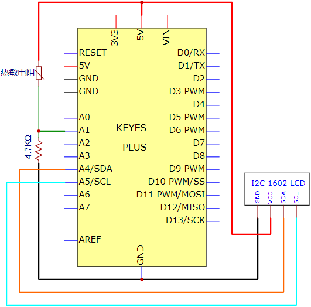


6.  项目代码：

注意：代码中需要安装I2C 1602     LCD库文件，如果已经添加了I2C 1602     LCD库文件，就忽略下面库文件的添加过程。

项目16中包含有I2C 1602     LCD的库文件，将文件夹中的库文件解压，即把解压后的LiquidCrystal_I2C文件夹放入编译器安装目录下的\Arduino\libraries里。

放置成功后，需要重启编译器，不然编译不过。

例如我的：C:\Program Files\Arduino\libraries


```cpp
/*
Keyes 2021入门学习套件
Project 27.2
The_temperature_instrument
http://www.keyes-robot.com
*/

#include <math.h>                // 引入数学库
#include <Wire.h>                // 引入I2C库
#include <LiquidCrystal_I2C.h>   // 引入液晶显示库

LiquidCrystal_I2C lcd(0x27, 16, 2); // 设置LCD地址为0x27, 16个字符，2行显示

const float voltagePower = 5.0;   // 供电电压
const float Rs_val = 4.7;          // 采样电阻为4.7千欧
const int B = 3950;                // 热敏电阻常数
const double T1 = 273.15 + 25;     // 常温（摄氏25度转为开尔文）
const double R1 = 10;              // 常温对应的阻值（千欧）

void setup() {
    Serial.begin(9600);           // 初始化串口通信
    lcd.init();                   // 初始化LCD
    lcd.backlight();              // 打开LCD背光
    lcd.clear();                  // 清除LCD显示
    lcd.setCursor(0, 0);          // 设置光标位置
    lcd.print("C v v=");          // 显示初始消息
}

void loop() {
    // 获取A1处的电压值
    double digitalValue = analogRead(1);
    double voltageValue = (digitalValue / 1023) * 5; // 转换为电压值

    // 通过分压比获得热敏电阻的阻值
    double Rt = ((voltagePower - voltageValue) * Rs_val) / voltageValue;

    // 换算得到温度值
    const float t = ((T1 * B) / (B + T1 * log(Rt / R1))) - 273.15; // 转换为摄氏度

    if (t > -100.0) { // 如果温度大于-100℃
        // 串口监视器显示电压值、热敏电阻阻值和温度值
        Serial.print("Current voltage value = ");
        Serial.println(voltageValue);
        Serial.print("Current register value = ");
        Serial.println(Rt);
        Serial.print("Current temperature value = ");
        Serial.println(t);
        Serial.println(" ");

        // LCD显示电压值和温度值
        lcd.setCursor(7, 0);
        lcd.print(voltageValue);
        lcd.setCursor(13, 0);
        lcd.print("V");
        lcd.setCursor(0, 1);
        lcd.print("C t v=");
        lcd.setCursor(7, 1);
        lcd.print(t);
        lcd.setCursor(13, 1);
        lcd.print("C");
        lcd.print(" ");
    } else {
        Serial.println("Error! check sensor!"); // 检测传感器错误信息
    }
    
    delay(500); // 每500毫秒更新一次数据
}
```


7.  项目结果：

将项目代码上传到Plus开发板，按照接线图接好线，上电后，I2C 1602 LCD显示A1引脚的电压值和当前环境中的温度值。同时打开串口监视器窗口，可以看到相应的A1引脚的电压值，通过分压比获得热敏电阻的阻值电阻值和当前环境中的温度值。

### 项目28：4x4矩阵键盘控制LED

项目介绍：

常用的数字按钮传感器，一个按钮就使用一个IO口，而有时我们需要的按钮比较多时，就会占用过多的IO口，为了节省IO口的使用，把多个按钮做成了矩阵类型，通过横纵端的控制，实现少IO口控制多个按钮。这节课我们将来学习有关薄膜4\*4矩阵键盘。

1.  项目元件：

|||||
|-|-|-|-|
|Keyes Uno Plus 控制板*1|薄膜4*4矩阵键盘*1|USB 线*1|跳线若干|

2.  元件知识：

4\*4矩阵键盘：键盘是一种集成了许多键的设备。如下图所示，一个4x4键盘集成16个键。


与LED矩阵集成一样，在4x4键盘中，每排键都是用一根引脚连接，每一列键都是一样的。这样的连接可以减少处理器端口的占用。内部电路如下所示。


使用方法类似于矩阵LED，即使用行扫描或列扫描方法检测每列或每行上的键的状态。以列扫描法为例，向第4列(Pin4)发送低电平，检测第1、2、3、4行电平状态，判断A、B、C、D键是否按下。然后依次将低电平发送到列3、2、1，检测是否有其它键被按下。然后，你可以获得所有键的状态。

3.  读取4\*4矩阵键盘的键值：

我们首先使用一个简单的代码读取4\*4矩阵键盘的键值，将其打印在串行监视器中，其接线图如下所示：

安装Keypad库：

我们将在下面的所有代码示例中使用Keypad库。

注意：代码中需要安装库文件，如果已经添加了Keypad库文件，就忽略下面库文件的添加过程。

将文件夹中的库文件解压，即把解压后的Keypad文件夹放入编译器安装目录下的\Arduino\libraries里。

放置成功后，需要重启编译器，不然编译不过。

例如我的：C:\Program Files\Arduino\libraries


```cpp
/*
Keyes 2021入门学习套件
Project 28.1
4x4_Keypad_display
http://www.keyes-robot.com
*/

#include <Keypad.h> // 引入键盘库

const byte ROWS = 4; // 定义行4
const byte COLS = 4; // 定义列4

// 定义4x4键盘按键布局
char keys[ROWS][COLS] = {
    {'1','2','3','A'},
    {'4','5','6','B'},
    {'7','8','9','C'},
    {'*','0','#','D'}
};

// 将4x4键盘的行端口连接到控制板上的相应数字IO
byte rowPins[ROWS] = {2, 3, 4, 5};

// 将4x4键盘的列端口连接到控制板上的相应数字IO
byte colPins[COLS] = {6, 7, 8, 9};

// 初始化键盘对象
Keypad keypad = Keypad(makeKeymap(keys), rowPins, colPins, ROWS, COLS);

void setup() {
    Serial.begin(9600); // 初始化串口通信
}

void loop() {
    char key = keypad.getKey(); // 获取按键值

    if (key != NO_KEY) { // 如果有按键被按下
        Serial.println(key); // 打印按下的按键
    }
}
```


将代码上传到Plus控制板，按接线图接好线，上电后，打开串行监视器，按下4\*4矩阵键盘的键，在打开串行监视器里可以读取对应的键值，例如：我们可以从下图看到，当我们按下#时，它将显示#。


4.  项目代码：(4\*4键盘控制LED实验)

使用上面的连接图。在这里，我们使用4\*4矩阵键盘的键来控制控制板上引脚13的LED。


```cpp
/*
Keyes 2021入门学习套件
Project 28.2
4x4_keyboard_control_LED
http://www.keyes-robot.com
*/

#include <Keypad.h> // 引入键盘库

const byte ROWS = 4; // 定义行4
const byte COLS = 4; // 定义列4

// 定义4x4键盘按键布局
char keys[ROWS][COLS] = {
    {'1','2','3','A'},
    {'4','5','6','B'},
    {'7','8','9','C'},
    {'*','0','#','D'}
};

// 将4x4键盘的行端口连接到控制板上的相应数字IO
byte rowPins[ROWS] = {2, 3, 4, 5};

// 将4x4键盘的列端口连接到控制板上的相应数字IO
byte colPins[COLS] = {6, 7, 8, 9};

// 初始化键盘对象
Keypad keypad = Keypad(makeKeymap(keys), rowPins, colPins, ROWS, COLS);

byte ledPin = 13; // LED引脚
boolean blink = false; // 控制闪烁状态

void setup() {
    Serial.begin(9600);       // 初始化串口通信
    pinMode(ledPin, OUTPUT);  // 设置数字引脚为输出
    digitalWrite(ledPin, HIGH); // 设置LED初始为亮
    keypad.addEventListener(keypadEvent); // 为键盘添加事件监听
}

void loop() {
    char key = keypad.getKey(); // 获取按键值

    if (key != NO_KEY) { // 如果有按键被按下
        Serial.println(key); // 打印按下的按键
    }

    if (blink) { // 如果闪烁状态为true
        digitalWrite(ledPin, !digitalRead(ledPin)); // 切换LED状态
        delay(100); // 延迟100毫秒
    }
}

// 处理键盘事件
void keypadEvent(KeypadEvent key) {
    switch (keypad.getState()) {
        case PRESSED: // 按键被按下
            switch (key) {
                case '#': 
                    digitalWrite(ledPin, !digitalRead(ledPin)); // 切换LED状态
                    break;
                case '*':
                    digitalWrite(ledPin, !digitalRead(ledPin)); // 切换LED状态
                    break;
            }
            break;
        case RELEASED: // 按键被释放
            switch (key) {
                case '*':
                    digitalWrite(ledPin, !digitalRead(ledPin)); // 切换LED状态
                    blink = false; // 停止闪烁
                    break;
            }
            break;
        case HOLD: // 按键保持
            switch (key) {
                case '*': 
                    blink = true; // 启动闪烁
                    break;
            }
            break;
    }
}
```


注意:
将我们在对应的文件夹中提供的Keypad库文件夹添加到安装目录Arduino编译器库中，否则编译失败。

5.  项目结果：

将代码上传到Plus控制板，按接线图接好线，上电后，当你按\*键时，Plus控制板上的pin 13的LED会一直亮直到你松开它。当你按下#键，然后释放它，LED会一直亮，直到你再次按下这个键。

### 项目29：WIFI 测试

1.  项目介绍：

ESP8266串口WIFI ESP-01模块，它是一款超低功耗的UART-WiFi透传模块，拥有业内极富竞争力的封装尺寸和超低能耗技术专为移动设备和物联网应用设计，可将用户的物理设备连接到Wi-Fi 无线网络上，进行互联网或局域网通信，实现联网功能。

2.  项目元件：

|||
|-|-|
|ESP8266串口WIFI ESP-01*1|USB转ESP-01S WIFI模块串口测试扩展板*1|

3.  元件知识：


USB转ESP-01S WIFI模块串口测试扩展板：适用于ESP-01S WiFi模块，扩展板的拨动开关打到flash boot端，直插于电脑USB口，用安信可串口调试助手测试AT指令。

扩展板的拨动开关打到Uart Download
端，直插于电脑USB口，ESP-01模块处于下载模式，通过安信可固件下载软件可下载固件到ESP-01模块中。


ESP8266串口WIFI ESP-01：ESP8266串口WIFI ESP-01是一款超低功耗的UART-WiFi 透传模块，ESP8266串口WIFI ESP-01可广泛应用于智能电网、智能交通、智能家具、手持设备、工业控制等领域。

（1）产品特性：

\*\* 支持无线802.11 b/g/n 标准

\*\* 支持STA/AP/STA+AP 三种工作模式

\*\* 内置TCP/IP协议栈，支持多路TCP Client连接

\*\* 支持丰富的Socket AT指令

\*\* 支持UART/GPIO数据通信接口

\*\* 支持Smart Link 智能联网功能

\*\* 支持远程固件升级（OTA）

\*\* 内置32位MCU，可兼作应用处理器

\*\* 超低能耗，高集成度的 Wi-Fi 芯片，适合电池供电应用

\*\* 超宽工作温度范围：-40°C 至 +125°C

\*\* 3.3V 单电源供电


3.  功耗：

下列功耗数据是基于3.3V的电源、25°的环境温度下测得。

1.所有测量均在天线接口处完成。

2.所有发射数据是基于 90% 的占空比，在持续发射的模式下测得的。

（5）射频指标：

以下数据是在室内温度下，电压为3.3V时测得。

|描述|最小值|通常|最大值|单位|
|-|-|-|-|-|
|输入频率|2412||2484|MHz|
|输入电阻||50||Ω|
|输入反射|||-10|dB|
|72.2Mbps下，PA的输出功率|14|15|16|dBm|
|802.11b模式下，PA的输出功率|17.5|18.5|19.5|dBm|

灵敏度
|CCK 1Mbps||-98||dBm|
|-|-|-|-|-|
|CCK 11Mbps||-91||dBm|
|6Mbps(1/2BPSK)||-93||dBm|
|54Mbps(3/4 64-QAM)||-75||dBm|
|HT20，MCS7（65Mbps，72.2Mbps）||-71||dBm|

邻频抑制
|OFDM，6Mbps||37||dB|
|-|-|-|-|-|
|OFDM，54Mbps||21||dB|
|HT20，MCS0||37||dB|
|HT20，MCS7||20||dB|

注：1. 72.2Mbps是在802.11n模式下，MCS=7，GI=200uS时测得；

2\. 802.11b模式下最高可达+19.5dBm的输出功率。

（6）功能描述：

A.主要功能

ESP8266可以实现的主要功能包括：串口透传，PWM 调控，GPIO控制。

※串口透传：数据传输，传输的可靠性好，最大的传输速率为：460800bps。

※PWM 调控：灯光调节，三色LED 调节，电机调速等。

※GPIO控制：控制开关，继电器等。

B.工作模式

ESP8266模块支持STA/AP/STA+AP 三种工作模式。

❊STA
模式：ESP8266模块通过路由器连接互联网，手机或电脑通过互联网实现对设备的远程控制。


❊AP
模式：ESP8266模块作为热点，实现手机或电脑直接与模块通信，实现局域网无线控制。

❊STA+AP
模式：两种模式的共存模式，即可以通过互联网控制可实现无缝切换，方便操作。

C.应用领域

✭✮串口CH340 转Wi-Fi；

✭✮工业透传DTU；

✭✮Wi-Fi 远程监控/控制；

✭✮玩具领域；

✭✮彩色LED 控制；

✭✮消防、安防智能一体化管理；

✭✮智能卡终端，无线POS 机，Wi-Fi 摄像头，手持设备等

4.  安装驱动文件

这个USB转ESP-01S WIFI模块串口测试扩展板的USB转串口芯片为CH340，我们需要安装这芯片的驱动，驱动为usb_ch341_3.1.2009.06，我们把该驱动放到D盘（即：复制放到D盘），然后开始安装驱动。在不同系统在安装驱动方式大同小异，这里我们在win10系统上开始安装驱动。

1.  当USB转ESP-01S WIFI模块串口测试扩展板第一次接入你的电脑, 右击桌面上的“我的电脑”—\>“属性”—\>“设备管理器”, 即可看到“USB-Serial”。

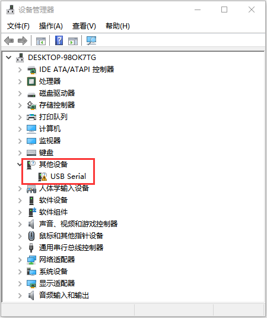

2.  点击 “USB-Serial”, 选择“更新驱动程序（P）”。


C.然后点击“浏览计算机以查找驱动程序软件”。


D.找到提供的“驱动文件”文件夹。


5.  安装完成后点击“关闭”。


6.  驱动安装完成后右键点击“我的电脑”—\>“属性”—\>“设备管理器”,     你可以看到你CH340驱动程序已经成功安装到电脑，如下图。

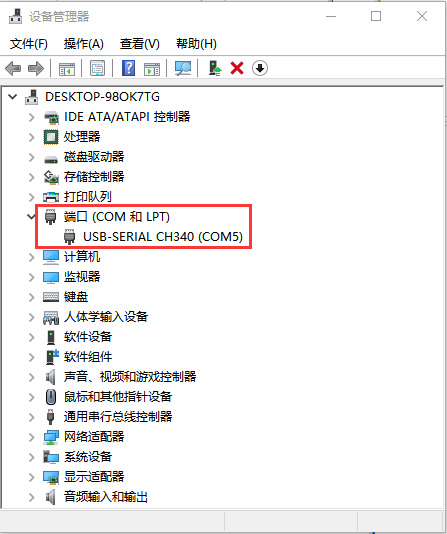

5.  将WIFI模块串口测试扩展板插入电脑的USB口：

1.  将ESP8266串口WIFI ESP-01模块正确方向插入USB转ESP-01S     WIFI模块串口测试扩展板上。

    

2.  先将USB转ESP-01S     WIFI模块串口测试扩展板上的拨码开关拨到UartDownload端，再将USB转ESP-01S     WIFI模块串口测试扩展板插入电脑的USB口。

    

Arduino搭建Esp8266开发环境

先将ESP8266串口WIFI ESP-01模块正确插入USB转ESP-01S WIFI模块串口测试扩展板中，然后将USB转ESP-01S WIFI模块串口测试扩展板插入电脑的USB口，点击进入arduino-1.8.13文件夹（也可以采用最新版本的），找到图标并点击进入1.8.13版本IDE界面。


1.  在Arduino IDE里面进行下载安装：

A.点击文件
→首选项，在“附加开发板管理器网址：”框中复制粘贴这个地址：http://arduino.esp8266.com/stable/package_esp8266com_index.json，然后点击“好”保存这个地址。


2.  先点击“工具”→“开发板：”，再点击“开发板管理器”进入“开发板管理器”页面，IDE会自动下载相关文件，如下图。


3.  相关文件下载成功后，在“全部”后空格中输入“ESP8266”，然后点击下面搜索内容，选择最新版本进行安装，安装包不大，点击“安装”开始安装相关插件。（可能会出现下载安装出错，有可能是服务器原因，需要重新点击“安装”就可以了，但由于网络原因，大多用户可能无法搜到esp8266   by esp8266  Community，对于小白而言不推荐使用此方法添加，推荐下面方法2）

    

    

4.  安装成功后点击“关闭”关闭页面，然后点击“工具”→“开发板：”，你可以在里面查看到各种不同型号ESP8266开发板。选择对应的ESP8266开发板型号和COM口，选中后即可对ESP8266进行编程。

    

    

2.  通过工具对ESP8266进行安装：（推荐使用这种方法）

使用“esp8266一键安装arduino板_2.5.0版.exe”，一键安装，此方法安装便捷，且安装较快，推荐此方法安装。


1.  鼠标左键双击“esp8266一键安装arduino板_2.5.0版.exe”，然后就安装完成了。

    

2.  在上述工具安装完成之后，重启 Arduino IDE 软件，点击 Arduino     菜单栏“工具”→“开发板：” ，可查看到各种不同型号ESP8266开发板。选择对应的ESP8266开发板型号，选中后即可对ESP8266进行编程。

    

    

6.  WIFI 测试代码：

注意：打开IDE后，一定要先设置好板型和COM口。如果家里没有WIFI需要打开手机热点共享WIFI


```cpp
/*
Keyes 2021入门学习套件
Project 29
WIFI test
http://www.keyes-robot.com
*/

#include <ESP8266WiFi.h>  // 引入ESP8266 WiFi库
#include <ESP8266mDNS.h>  // 引入mDNS库
#include <WiFiClient.h>   // 引入WiFi客户端库

#ifndef STASSID
//#define STASSID "your-ssid"
//#define STAPSK "your-password"
#define STASSID "ChinaNet-2.4G-0DF0" // 用户WiFi名称
#define STAPSK "ChinaNet@233" // 用户WiFi密码
#endif

const char* ssid = STASSID; // WiFi名称
const char* password = STAPSK; // WiFi密码

// 端口80的TCP服务器将响应HTTP请求
WiFiServer server(80);

void setup(void) {
    Serial.begin(115200); // 初始化串口通信

    // 连接WiFi网络
    WiFi.mode(WIFI_STA);
    WiFi.begin(ssid, password);
    Serial.println("");

    // 等待连接
    while (WiFi.status() != WL_CONNECTED) {
        delay(500);
        Serial.print(".");
    }

    Serial.println("");
    Serial.print("Connected to ");
    Serial.println(ssid);
    Serial.print("IP address: ");
    Serial.println(WiFi.localIP());

    // 设置mDNS响应器
    // - 在本例中，第一个参数是域名
    // 完全限定域名为“esp8266.local”
    // - 第二个参数是IP地址
    // 我们通过WiFi网络发送IP地址
    if (!MDNS.begin("esp8266")) {
        Serial.println("Error setting up MDNS responder!");
        while (1) {
            delay(1000);
        }
    }

    Serial.println("mDNS responder started");
    
    // 启动TCP (HTTP)服务器
    server.begin();
    Serial.println("TCP server started");

    // 添加服务器到 MDNS-SD
    MDNS.addService("http", "tcp", 80);
}

void loop(void) {
    MDNS.update(); // 更新mDNS

    // 检查客户端是否已连接
    WiFiClient client = server.available();
    if (!client) {
        return;
    }

    Serial.println("");
    Serial.println("New client");

    // 等待来自客户端的数据有效
    while (client.connected() && !client.available()) {
        delay(1);
    }

    // 读取HTTP请求的第一行
    String req = client.readStringUntil('\r');
    // HTTP请求的第一行如下所示 "GET /path HTTP/1.1"
    // 提取"/path"部分
    int addr_start = req.indexOf(' ');
    int addr_end = req.indexOf(' ', addr_start + 1);

    if (addr_start == -1 || addr_end == -1) {
        Serial.print("Invalid request: ");
        Serial.println(req);
        return;
    }

    req = req.substring(addr_start + 1, addr_end);
    Serial.print("Request: ");
    Serial.println(req);

    client.flush(); // 清空缓存
    String s;

    if (req == "/") {
        IPAddress ip = WiFi.localIP();
        String ipStr = String(ip[0]) + '.' + String(ip[1]) + '.' + String(ip[2]) + '.' + String(ip[3]);
        s = "HTTP/1.1 200 OK\r\nContent-Type: text/html\r\n\r\n<!DOCTYPE HTML>\r\n<html>Hello from ESP8266 at ";
        s += ipStr;
        s += "</html>\r\n\r\n";
        Serial.println("Sending 200");
    } else {
        s = "HTTP/1.1 404 Not Found\r\n\r\n";
        Serial.println("Sending 404");
    }

    client.print(s); // 发送响应
    Serial.println("Done with client");
}
```


7.  项目结果：

特别注意：需要先将项目代码


中的用户Wifi名称和用户Wifi密码改成你们自己的Wifi名称和Wifi密码。

 Wifi名称和Wifi密码修改后，确保USB转ESP-01S     WIFI模块串口测试扩展板上的拨码开关已经拨到Uart Download     端，并且也确定USB转ESP-01S     WIFI模块串口测试扩展板已经插入电脑的USB口。然后按照前面方法设置板型和COM口，IDE右下角显示对应板型和COM口，再点击将测试代码上传到ESP8266串口WIFI     ESP-01模块上，上传成功。（注意：如果上传失败，在板型和COM口没问题下，将USB转ESP-01S     WIFI模块串口测试扩展板从电脑的USB口拔下来再次插到电脑的USB口）


测试代码上传成功后，先将USB转ESP-01S     WIFI模块串口测试扩展板从电脑的USB口拔下来，再将USB转ESP-01S     WIFI模块串口测试扩展板上的拨码开关拨到Flash Boot     端，然后再次插到电脑的USB口上。打开串口监视器，设置波特率为115200，即可看到你的WIFI信息，如下图所示：


### 项目30：WIFI 控制LED

1.  项目介绍：

在前面的项目29中，我们已经知道ESP8266串口WIFI     ESP-01模块通过WIFI测试代码得到相关的WIFI信息。那么在这个项目中，我们将使用ESP8266串口WIFI     ESP-01模块通过APP和WIFI来控制Plus 控制板上的LED点亮和熄灭的效果。

2.  项目元件：

||||
|-|-|-|
|Keyes Uno Plus 控制板*1|USB转ESP-01S WIFI模块串口测试扩展板*1|公对母杜邦线*5|
||||
|ESP8266串口WIFI ESP-01*1|智能手机/IPad*1|USB 线*1|

3.  将WIFI模块串口测试扩展板插入电脑的USB口：

1.  将ESP8266串口WIFI ESP-01模块正确方向插入USB转ESP-01S     WIFI模块串口测试扩展板上。

    

2.  先将USB转ESP-01S     WIFI模块串口测试扩展板上的拨码开关拨到UartDownload端，再将USB转ESP-01S     WIFI模块串口测试扩展板插入电脑的USB口。

    

4.  ESP8266 代码：


```cpp
/*
Keyes 2021入门学习套件
Project 30.1
ESP8266_Code
http://www.keyes-robot.com
*/

// generated by KidsBlock
#include <Arduino.h>       // 引入Arduino核心库
#include <ESP8266WiFi.h>   // 引入ESP8266 WiFi库
#include <ESP8266mDNS.h>   // 引入mDNS库
#include <WiFiClient.h>    // 引入WiFi客户端库

#ifndef STASSID
#define STASSID "ChinaNet-2.4G-0DF0" // 用户WiFi名称
#define STAPSK "ChinaNet@233" // 用户WiFi密码
#endif

const char* ssid = STASSID; // WiFi名称
const char* password = STAPSK; // WiFi密码

WiFiServer server(80); // 创建TCP服务器，监听80端口

String unoData = ""; // 用于存储从单片机读取的数据
int ip_flag = 0; // IP标志
int ultra_state = 1; // 超声波状态
String ip_str; // 存储IP地址字符串

void setup() {
    Serial.begin(9600); // 初始化串口通信
    WiFi.mode(WIFI_STA); // 设定WiFi模式为站点模式
    WiFi.begin(ssid, password); // 开始连接WiFi

    while (WiFi.status() != WL_CONNECTED) {
        delay(500); // 等待连接
        Serial.print(".");
    }

    Serial.print("IP ADDRESS: ");
    Serial.println(WiFi.localIP()); // 打印本地IP地址

    if (!MDNS.begin("esp8266")) {
        //Serial.println("Error setting up MDNS responder!");
        while (1) {
            delay(1000);
        }
    }

    //Serial.println("mDNS responder started");
    server.begin(); // 启动TCP服务器
    //Serial.println("TCP server started");
    MDNS.addService("http", "tcp", 80); // 将HTTP服务添加到MDNS
    ip_flag = 1; // 设置IP标志
}

void loop() {
    if (ip_flag == 1) {
        Serial.print("IP: ");
        Serial.println(WiFi.localIP()); // 打印WiFi本地IP
        delay(100);
    }

    MDNS.update(); // 更新mDNS
    WiFiClient client = server.available(); // 检查客户端请求

    if (!client) {
        return; // 如果没有客户端连接，返回
    }

    while (client.connected() && !client.available()) {
        delay(1); // 等待客户端请求
    }

    String req = client.readStringUntil('\r'); // 读取HTTP请求
    int addr_start = req.indexOf(' ');
    int addr_end = req.indexOf(' ', addr_start + 1);

    if (addr_start == -1 || addr_end == -1) {
        //Serial.print("Invalid request: ");
        //Serial.println(req);
        return; // 请求无效，返回
    }

    req = req.substring(addr_start + 1, addr_end);
    client.flush(); // 清空缓存
    String s;

    // 处理不同的请求路径
    if (req == "/") {
        IPAddress ip = WiFi.localIP();
        String ipStr = String(ip[0]) + '.' + String(ip[1]) + '.' + String(ip[2]) + '.' + String(ip[3]);
        s = "HTTP/1.1 200 OK\r\nContent-Type: text/html\r\n\r\n<!DOCTYPE HTML>\r\n<html>Hello from ESP8266 at ";
        s += ipStr;
        s += "</html>\r\n\r\n";
        //Serial.println("Sending 200");
        Serial.println(WiFi.localIP());
        Serial.write('*');
        client.println(WiFi.localIP());
        ip_flag = 0; // 处理完请求后重置IP标志
    } else if (req == "/btn/0") {
        Serial.write('a');
        client.println("turn on the relay");
    } else if (req == "/btn/1") {
        Serial.write('b');
        client.println("turn off the relay");
    } else if (req == "/btn/2") {
        Serial.write('c');
        client.println("Bring the steering gear over 180 degrees");
    } else if (req == "/btn/3") {
        Serial.write('d');
        client.println("Bring the steering gear over 0 degrees");
    } else if (req == "/btn/4") {
        Serial.write('e');
        client.println("esp8266 already turn on the fans");
    } else if (req == "/btn/5") {
        Serial.write('f');
        client.println("esp8266 already turn off the fans");
    } else if (req == "/btn/6") {
        Serial.write('g');
        while (Serial.available() > 0) {
            unoData = Serial.readStringUntil('#');
            client.println(unoData);
        }
    } else if (req == "/btn/7") {
        Serial.write('h');
        client.println("turn off the ultrasonic");
    } else if (req == "/btn/8") {
        Serial.write('i');
        while (Serial.available() > 0) {
            unoData = Serial.readStringUntil('#');
            client.println(unoData);
        }
    } else if (req == "/btn/9") {
        Serial.write('j');
        client.println("turn off the temperature");
    } else if (req == "/btn/10") {
        Serial.write('k');
        while (Serial.available() > 0) {
            unoData = Serial.readStringUntil('#');
            client.println(unoData);
        }
    } else if (req == "/btn/11") {
        Serial.write('l');
        client.println("turn off the humidity");
    } else if (req == "/btn/12") {
        Serial.write('m');
        client.println(F("m"));
    } else if (req == "/btn/13") {
        Serial.write('n');
        client.println(F("n"));
    } else if (req == "/btn/14") {
        Serial.write('o');
        client.println(F("o"));
    } else if (req == "/btn/15") {
        Serial.write('p');
        client.println(F("p"));
    } else if (req == "/btn/16") {
        Serial.write('q');
        client.println(F("q"));
    } else if (req == "/btn/17") {
        Serial.write('r');
        client.println(F("r"));
    } else if (req == "/btn/18") {
        Serial.write('s');
        client.println(F("s"));
    } else if (req == "/btn/19") {
        Serial.write('t');
        client.println(F("t"));
    } else if (req == "/btn/20") {
        Serial.write('u');
        client.println(F("u"));
    } else if (req == "/btn/21") {
        Serial.write('v');
        client.println(F("v"));
    } else if (req == "/btn/22") {
        Serial.write('w');
        client.println(F("w"));
    } else if (req == "/btn/23") {
        Serial.write('x');
        client.println(F("x"));
    } else {
        //s = "HTTP/1.1 404 Not Found\r\n\r\n";
        //Serial.println("Sending 404");
    }

    client.print(F("IP : "));
    client.println(WiFi.localIP()); // 返回当前的IP地址
}
```


特别注意：需要先将项目代码


中的用户Wifi名称和用户Wifi密码改成你们自己的Wifi名称和Wifi密码。

Wifi名称和Wifi密码修改后，确保USB转ESP-01S WIFI模块串口测试扩展板上的拨码开关已经拨到Uart Download
端，并且也确定USB转ESP-01S WIFI模块串口测试扩展板已经插入电脑的USB口。然后按照项目29中的方法设置板型和COM口，IDE右下角显示对应板型和COM口，再点击将测试代码上传到ESP8266串口WIFI ESP-01模块上，上传成功。（注意：如果上传失败，在板型和COM口没问题情况下，将USB转ESP-01S WIFI模块串口测试扩展板从电脑的USB口拔下来再次插到电脑的USB口）


测试代码上传成功后，先将USB转ESP-01S WIFI模块串口测试扩展板从电脑的USB口拔下来，再将ESP8266串口WIFI ESP-01模块从USB转ESP-01S WIFI模块串口测试扩展板上拔下来。

5.  项目接线：

    

6.  项目代码：

注意：打开IDE后，一定要先设置好板型和COM口。如果家里没有WIFI需要打开手机热点共享WIFI


```cpp
/*
Keyes 2021入门学习套件
Project 30.2
WIFI control LED
http://www.keyes-robot.com
*/

const int ledPin = 13; // LED引脚定义
char wifiData; // 存储WiFi数据

void setup() {
    Serial.begin(9600); // 初始化串口通信
    pinMode(ledPin, OUTPUT); // 设置LED引脚为输出
}

void loop() {
    if (Serial.available() > 0) { // 检查是否有可读数据
        wifiData = Serial.read(); // 读取数据
        Serial.print(wifiData); // 打印读取的数据

        if (wifiData == '#') { // 检测到结束标志
            Serial.println("");
        }

        delay(100); // 延迟100毫秒

        // 根据接收到的指令控制LED
        if (wifiData == 'a') {
            digitalWrite(ledPin, HIGH); // 点亮LED
        } else if (wifiData == 'b') {
            digitalWrite(ledPin, LOW); // 关闭LED
        }
    }
}
```


特别注意：上传项目代码前，需要先将连接到Plus控制板上的TX和RX的杜邦线先拔下来，要不然代码上传不成功。然后点击“工具”→“开发板：”，选择Arduino UNO板，选择正确的COM端口，最后再将项目代码上传至Plus控制板。上传代码成功后，再将接在ESP8266串口WIFI ESP-01模块上的TX杜邦线另一端接到Plus控制板上的RX(0)引脚，RX的杜邦线另一端接到Plus控制板上的TX(1)引脚。点击打开串口监视器窗口，将波特率设置为9600。这样，串口监视器就显示此时你们WIFI的IP地址。（WIFI的IP地址有时候会改变，如果原来的IP地址不行，需要重新检测WIFI的IP地址）


7.APP：

安卓系统设备（手机/iPad）APP：

现将文件夹中的keyes wifi.apk文件转移到安卓系统手机或Ipad上，点击keyes wifi.apk文件进入安装页面，点击“安装”按钮，然后再点击“继续安装”按钮，安装完成后点击“打开”按钮就可以进入APP界面。


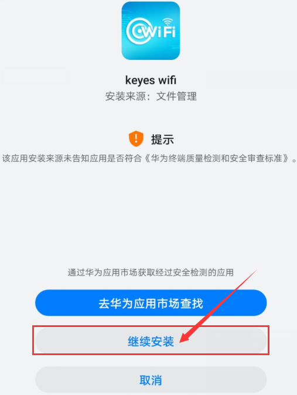


在WIFI按钮前面的文本框中输入检测到的WIFI IP地址（例如，上面串口监视器检测到的IP地址：192.168.1.136），再点击WIFI按钮，“403 Forbidden”或“网页无法打开”就会变成“192.168.1.136”。这样，就说明APP已经连接上了WIFI。


IOS系统设备（手机/iPad）APP

a.打开App Store。


b.在搜索框输入keyes wifi，点击搜索，出现下载界面，点击“”，就可以下载安装keyes wifi的APP。接下来的操作和安卓系统类似的，可以参考上面安卓系统的步骤进行操作。

8. 项目结果：

注意：点击APP上的按钮，ESP8266串口WIFI ESP-01模块上的蓝色指示灯会闪烁，说明APP已经连接上WIFI。

APP已经连接上了WIFI后，开始进行如下操作：

点击APP上的按钮，串口监视器会打印一些对应的控制字符，如下如图所示：


点击按钮，Plus
控制板上的LED点亮，再次点击按钮，Plus
控制板上的LED熄灭。

### 项目31：WIFI的智能家居

1.  项目介绍：

在前面的项目30中，我们已经知道APP怎样连接上WIFI，并且还用APP通过WIFI控制Plus控制板上LED亮和灭的简单实验。那么在这个项目中，我们将使用APP通过WIFI控制多个传感器/模块工作，实现WIFI智能家居的效果。

2.  项目元件：

||||||
|-|-|-|-|-|
|Keyes Uno Plus 控制板*1|传感器扩展板*1|超声波传感器*1|温湿度传感器*1|舵机*1|
||||||
|USB转ESP-01S WIFI模块串口测试扩展板*1|ESP8266串口WIFI ESP-01*1|5V继电器模块*1|公对母杜邦线*5|USB 线*1|
| |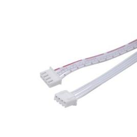||||
|手机/IPad*1|4P双头连接线*1|3P双头连接线*2|||

3.  将WIFI模块串口测试扩展板插入电脑的USB口：

1.  将ESP8266串口WIFI ESP-01模块正确方向插入USB转ESP-01S     WIFI模块串口测试扩展板上。

    

2.  先将USB转ESP-01S     WIFI模块串口测试扩展板上的拨码开关拨到UartDownload端，再将USB转ESP-01S     WIFI模块串口测试扩展板插入电脑的USB口。

    

4.  ESP8266 代码：


```cpp
/*
Keyes 2021入门学习套件
Project 31.1
ESP8266_Code
http://www.keyes-robot.com
*/

// generated by KidsBlock
#include <Arduino.h>       // 引入Arduino核心库
#include <ESP8266WiFi.h>   // 引入ESP8266 WiFi库
#include <ESP8266mDNS.h>   // 引入mDNS库
#include <WiFiClient.h>    // 引入WiFi客户端库

#ifndef STASSID
#define STASSID "ChinaNet-2.4G-0DF0" // 用户WiFi名称
#define STAPSK "ChinaNet@233" // 用户WiFi密码
#endif

const char* ssid = STASSID; // WiFi名称
const char* password = STAPSK; // WiFi密码

WiFiServer server(80); // 创建TCP服务器，监听80端口

String unoData = ""; // 用于存储从单片机读取的数据
int ip_flag = 0; // IP标志
int ultra_state = 1; // 超声波状态
String ip_str; // 存储IP地址字符串

void setup() {
    Serial.begin(9600); // 初始化串口通信
    WiFi.mode(WIFI_STA); // 设定WiFi模式为站点模式
    WiFi.begin(ssid, password); // 开始连接WiFi

    while (WiFi.status() != WL_CONNECTED) {
        delay(500); // 等待连接
        Serial.print(".");
    }

    Serial.print("IP ADDRESS: ");
    Serial.println(WiFi.localIP()); // 打印本地IP地址

    if (!MDNS.begin("esp8266")) {
        //Serial.println("Error setting up MDNS responder!");
        while (1) {
            delay(1000);
        }
    }

    // Serial.println("mDNS responder started");
    server.begin(); // 启动TCP服务器
    //Serial.println("TCP server started");
    MDNS.addService("http", "tcp", 80); // 将HTTP服务添加到MDNS
    ip_flag = 1; // 设置IP标志
}

void loop() {
    if (ip_flag == 1) {
        Serial.print("IP: ");
        Serial.println(WiFi.localIP()); // 打印WiFi本地IP
        delay(100);
    }

    MDNS.update(); // 更新mDNS
    WiFiClient client = server.available(); // 检查客户端请求

    if (!client) {
        return; // 如果没有客户端连接，返回
    }

    while (client.connected() && !client.available()) {
        delay(1); // 等待客户端请求
    }

    String req = client.readStringUntil('\r'); // 读取HTTP请求
    int addr_start = req.indexOf(' ');
    int addr_end = req.indexOf(' ', addr_start + 1);

    if (addr_start == -1 || addr_end == -1) {
        //Serial.print("Invalid request: ");
        //Serial.println(req);
        return; // 请求无效，返回
    }

    req = req.substring(addr_start + 1, addr_end); // 提取请求的路径
    client.flush(); // 清空缓存

    String s;

    // 处理不同的请求路径
    if (req == "/") {
        IPAddress ip = WiFi.localIP();
        String ipStr = String(ip[0]) + '.' + String(ip[1]) + '.' + String(ip[2]) + '.' + String(ip[3]);
        s = "HTTP/1.1 200 OK\r\nContent-Type: text/html\r\n\r\n<!DOCTYPE HTML>\r\n<html>Hello from ESP8266 at ";
        s += ipStr;
        s += "</html>\r\n\r\n";
        //Serial.println("Sending 200");
        Serial.println(WiFi.localIP());
        Serial.write('*');
        client.println(WiFi.localIP());
        ip_flag = 0; // 处理完请求后重置IP标志
    } else if (req == "/btn/0") {
        Serial.write('a');
        client.println("turn on the relay");
    } else if (req == "/btn/1") {
        Serial.write('b');
        client.println("turn off the relay");
    } else if (req == "/btn/2") {
        Serial.write('c');
        client.println("Bring the steering gear over 180 degrees");
    } else if (req == "/btn/3") {
        Serial.write('d');
        client.println("Bring the steering gear over 0 degrees");
    } else if (req == "/btn/4") {
        Serial.write('e');
        client.println("esp8266 already turn on the fans");
    } else if (req == "/btn/5") {
        Serial.write('f');
        client.println("esp8266 already turn off the fans");
    } else if (req == "/btn/6") {
        Serial.write('g');
        while (Serial.available() > 0) {
            unoData = Serial.readStringUntil('#');
            client.println(unoData);
        }
    } else if (req == "/btn/7") {
        Serial.write('h');
        client.println("turn off the ultrasonic");
    } else if (req == "/btn/8") {
        Serial.write('i');
        while (Serial.available() > 0) {
            unoData = Serial.readStringUntil('#');
            client.println(unoData);
        }
    } else if (req == "/btn/9") {
        Serial.write('j');
        client.println("turn off the temperature");
    } else if (req == "/btn/10") {
        Serial.write('k');
        while (Serial.available() > 0) {
            unoData = Serial.readStringUntil('#');
            client.println(unoData);
        }
    } else if (req == "/btn/11") {
        Serial.write('l');
        client.println("turn off the humidity");
    } else if (req == "/btn/12") {
        Serial.write('m');
        client.println(F("m"));
    } else if (req == "/btn/13") {
        Serial.write('n');
        client.println(F("n"));
    } else if (req == "/btn/14") {
        Serial.write('o');
        client.println(F("o"));
    } else if (req == "/btn/15") {
        Serial.write('p');
        client.println(F("p"));
    } else if (req == "/btn/16") {
        Serial.write('q');
        client.println(F("q"));
    } else if (req == "/btn/17") {
        Serial.write('r');
        client.println(F("r"));
    } else if (req == "/btn/18") {
        Serial.write('s');
        client.println(F("s"));
    } else if (req == "/btn/19") {
        Serial.write('t');
        client.println(F("t"));
    } else if (req == "/btn/20") {
        Serial.write('u');
        client.println(F("u"));
    } else if (req == "/btn/21") {
        Serial.write('v');
        client.println(F("v"));
    } else if (req == "/btn/22") {
        Serial.write('w');
        client.println(F("w"));
    } else if (req == "/btn/23") {
        Serial.write('x');
        client.println(F("x"));
    } else {
        //s = "HTTP/1.1 404 Not Found\r\n\r\n";
        //Serial.println("Sending 404");
    }

    client.print(F("IP : "));
    client.println(WiFi.localIP()); // 返回当前的IP地址
}
```

特别注意：需要先将项目代码


中的用户Wifi名称和用户Wifi密码改成你们自己的Wifi名称和Wifi密码。

Wifi名称和Wifi密码修改后，确保USB转ESP-01S WIFI模块串口测试扩展板上的拨码开关已经拨到Uart Download
端，并且也确定USB转ESP-01S WIFI模块串口测试扩展板已经插入电脑的USB口。然后按照项目29中的方法设置板型和COM口，IDE右下角显示对应板型和COM口，再点击将测试代码上传到ESP8266串口WIFI ESP-01模块上，上传成功。（注意：如果上传失败，在板型和COM口没问题情况下，将USB转ESP-01S WIFI模块串口测试扩展板从电脑的USB口拔下来再次插到电脑的USB口）


测试代码上传成功后，先将USB转ESP-01S WIFI模块串口测试扩展板从电脑的USB口拔下来，再将ESP8266串口WIFI ESP-01模块从USB转ESP-01S WIFI模块串口测试扩展板上拔下来。

1.  项目接线：


2.  项目代码：

注意：打开IDE后，一定要先设置好板型和COM口。如果家里没有WIFI需要打开手机热点共享WIFI


```cpp
/*
Keyes 2021入门学习套件
Project 31.2
WIFI smart home
http://www.keyes-robot.com
*/

#include <DHT.h>          // 引入DHT库
DHT dht(2, 11);          // 初始化DHT传感器
#include <Servo.h>        // 引入Servo库

Servo myservo;            // 创建Servo对象

char wifiData;           // 存储WiFi数据
int distance1;           // 距离值
String dis_str;          // 距离字符串

const int dhtPin = 2;    // DHT传感器引脚
const int relayPin = 5;  // 继电器引脚
const int trigPin = 12;  // 超声波传感器Trig引脚
const int echoPin = 13;  // 超声波传感器Echo引脚
const int servoPin = 9;  // Servo引脚

int ip_flag = 1;         // IP标志
int ultra_state = 1;     // 超声波状态
int temp_state = 1;      // 温度状态
int humidity_state = 1;  // 湿度状态

void setup() {
    Serial.begin(9600);                // 初始化串口通信
    pinMode(dhtPin, INPUT);            // 设置DHT引脚为输入
    pinMode(relayPin, OUTPUT);         // 设置继电器引脚为输出
    pinMode(servoPin, OUTPUT);         // 设置Servo引脚为输出
    pinMode(trigPin, OUTPUT);          // 设置超声波Trig引脚为输出
    pinMode(echoPin, INPUT);           // 设置超声波Echo引脚为输入
    digitalWrite(relayPin, LOW);       // 关闭继电器
    myservo.attach(9);                  // 连接Servo到指定引脚
    dht.begin();                        // 初始化DHT传感器
}

void loop() {
    if (Serial.available() > 0) {
        wifiData = Serial.read(); // 读取WiFi数据

        if (wifiData == '*') {
            ip_flag = 0; // 如果接收到*，则设置IP标志为0
        }

        if (ip_flag == 1) {
            Serial.print(wifiData); // 打印WiFi数据
            if (wifiData == '#') {
                Serial.println(""); // 接收到#时换行
            }
            delay(100); // 延迟100毫秒
        }
    }

    // 根据接收到的指令执行相应操作
    switch (wifiData) {
        case 'a': digitalWrite(relayPin, HIGH); break; // 打开继电器
        case 'b': digitalWrite(relayPin, LOW); break;  // 关闭继电器
        case 'c': myservo.write(180); delay(200); break; // Servo转到180度
        case 'd': myservo.write(0); delay(200); break;   // Servo转到0度
        case 'g': while (ultra_state > 0) { // 获取距离
            Serial.print("Distance = ");
            Serial.print(checkdistance());
            Serial.println("#");
            ultra_state = 0;
        }
        break;
        case 'h': ultra_state = 1; break; // 重置超声波状态
        case 'i': while (temp_state > 0) { // 获取温度
            Serial.print("Temperature = ");
            Serial.print(dht.readTemperature());
            Serial.println("#");
            temp_state = 0;
        }
        break;
        case 'j': temp_state = 1; break; // 重置温度状态
        case 'k': while (humidity_state > 0) { // 获取湿度
            Serial.print("Humidity = ");
            Serial.print(dht.readHumidity());
            Serial.println("#");
            humidity_state = 0;
        }
        break;
        case 'l': humidity_state = 1; break; // 重置湿度状态
    }
}

int checkdistance() {
    digitalWrite(trigPin, LOW); // 设置Trig为低电平
    delayMicroseconds(2);
    digitalWrite(trigPin, HIGH); // 设置Trig为高电平
    delayMicroseconds(10);
    digitalWrite(trigPin, LOW); // 设置Trig为低电平

    int distance = pulseIn(echoPin, HIGH) / 58; // 计算距离
    delay(10);
    return distance; // 返回距离值
}
```


7.  项目结果：

特别注意：上传项目代码前，需要先将连接到Plus控制板上的TX和RX的杜邦线先拔下来，要不然代码上传不成功。然后点击“工具”→“开发板：”，选择Arduino     UNO板，选择正确的COM端口，最后再将项目代码上传至Plus控制板。上传代码成功后，再将接在ESP8266串口WIFI     ESP-01模块上的TX杜邦线另一端接到Plus控制板上的RX(0)引脚，RX的杜邦线另一端接到Plus控制板上的TX(1)引脚。点击打开串口监视器窗口，将波特率设置为9600。这样，串口监视器就显示此时你们WIFI的IP地址。（WIFI的IP地址有时候会改变，如果原来的IP地址不行，需要重新检测WIFI的IP地址）


安卓系统设备（手机/iPad）APP：

现将文件夹中的keyes wifi.apk文件转移到安卓系统手机或Ipad上，点击keyes wifi.apk文件进入安装页面，点击“安装”按钮，然后再点击“继续安装”按钮，安装完成后点击“打开”按钮就可以进入APP界面。

    

    
    

    

    

    

    在WIFI按钮前面的文本框中输入检测到的WIFI     IP地址（例如，上面串口监视器检测到的IP地址：192.168.1.125），再点击WIFI按钮，“403     Forbidden”或“网页无法打开”就会变成“192.168.1.125”。这样，就说明APP已经连接上了WIFI。

    

IOS系统设备（手机/iPad）APP

a.打开App Store。


b.在搜索框输入keyes wifi，点击搜索，出现下载界面，点击“”，就可以下载安装keyes wifi的APP。接下来的操作和安卓系统类似的，可以参考上面安卓系统的步骤进行操作。

注意：点击APP上的按钮，ESP8266串口WIFI ESP-01模块上的蓝色指示灯会闪烁，说明APP已经连接上WIFI。

APP已经连接上了WIFI后，开始进行如下操作：

1.  点击按钮，继电器打开，APP上显示，模块上的指示灯点亮；再次点击按钮，继电器关闭，APP上显示，模块上的指示灯不亮。

2.  点击按钮，舵机转动180°，APP上显示；再次点击按钮，APP上显示，舵机转动0°。

3.  点击按钮，超声波传感器测距，在超声波传感器前放一个物体，APP上显示（不同的距离显示不同的数字），说明此时物体离超声波传感器的距离为14cm，点击按钮，关闭超声波，APP上显示。

4.  点击按钮，温湿度传感器测量环境中的温度，APP上显示，说明此时环境中的温度为28℃；再次点击按钮，关闭温湿度传感器，APP上显示。

5.  点击按钮，温湿度传感器测量环境中的湿度，APP上显示，说明此时环境中的湿度为52%；再次点击按钮，关闭温湿度传感器，APP上显示。
