# Mixly 软件

1.Mixly 软件下载、安装及更新

下载（以下链接中提供了两种安装包）

Mixly 1.2.0 for Win 7/8/10：http://8.210.52.206/Mixly/Windows/Mixly_WIN%20v1.2.0.7z

Mixly 1.2.0 for Mac：http://8.210.52.206/Mixly/Mac/Mixly_Mac%20v1.2.0.zip

（注意：我们在文件夹中也提供了Mixly_WIN.7Z和Mixly_Mac安装压缩包）

## Mixly_WIN安装方法：

1.下载 Mixly_WIN.7Z 安装压缩包

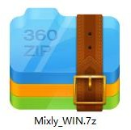

2.将压缩包解压到某个硬盘的根目录，如D:Mixly。

注意：目录中不要包括中文、空格、括号等特殊字符。

解压后，显示如下图。

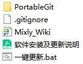

3.  首次安装 Mixly 需要运行 一件更新.bat文件，运行后会提示 Mixly     软件安装&升级助手的使用方法。

    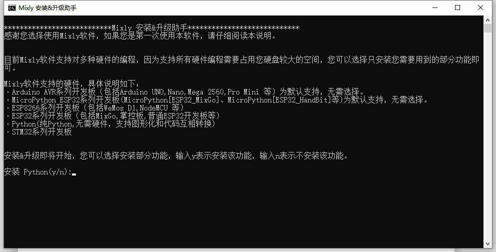

    根据提示，输入y 或者 n，来安装您所需要的模块。

如只需要 Mixly 的基础功能，就输入 n。

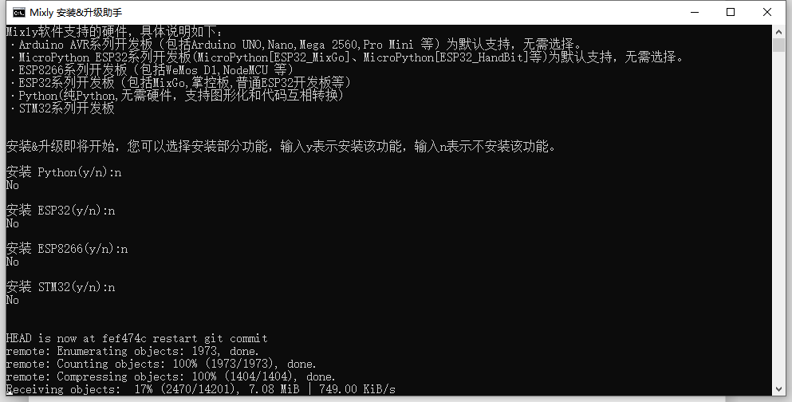

或者，如需要安装Mixly 高级功能，就输入 y。

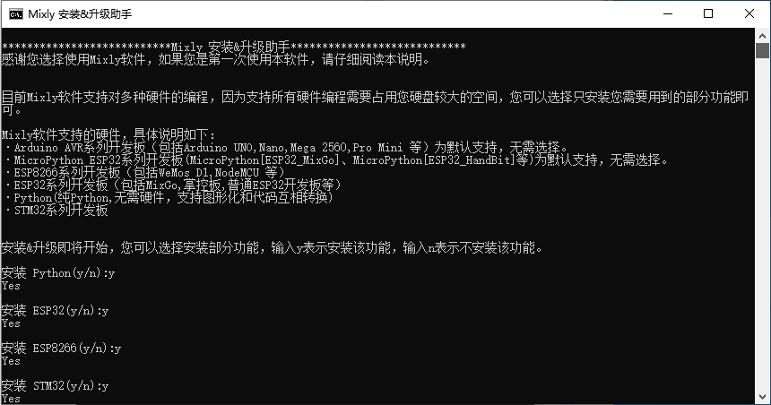

接下来一件更新助手将会根据您的选择安装所需模块。

安装完成后，会显示“请按任意键继续..”。说明安装完成。

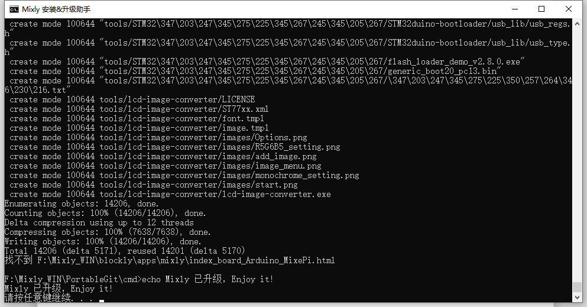

安装完成后就可以看到完整的 Mixly 软件目录，运行 Mixly.exe 即可开启软件。

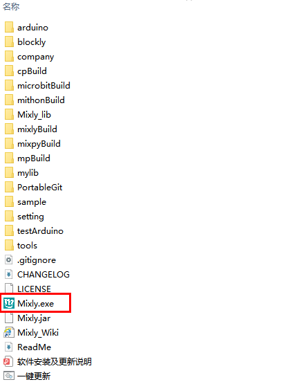

4.  Mixly 软件的更新

Mixly 软件的更新与安装方法相同，运行一件更新.bat
文件，选择需要安装的模块即可，一件更新助手会自动下载最新版文件。

5.  Mixly 软件相关使用教程

>https://www.bilibili.com/video/bv1BE411A7hX

https://www.bilibili.com/video/BV1jE411A78S

https://www.bilibili.com/video/BV1YE411A7FT

https://wiki.mixly.org/

## 1.2 在Windows系统上安装驱动：（注意：如果电脑已经安装了驱动程序，则不需要再次安装驱动；如果没有，则需要进行以下操作）

在使用Keyes Uno Plus控制板之前，必须安装它的驱动程序，否则它将无法与计算机通信。与Arduino UNO R3的USB系列芯片(ATMEGA8U2)不同，Keyes Uno Plus控制板采用了USB系列芯片CP2102芯片和USB C型接口。在Mixly1.2软件中的Arduino IDE
是1.8.0版本及以上版本，1.8.0版本及以上版本中包含了CP2102芯片的驱动程序。通常，您将控制板通过USB线连接到计算机，电脑就会识别到硬件，WINDOWS系统就会自动安装CP2102的驱动。过一会儿，CP2102
驱动就会安装成功。

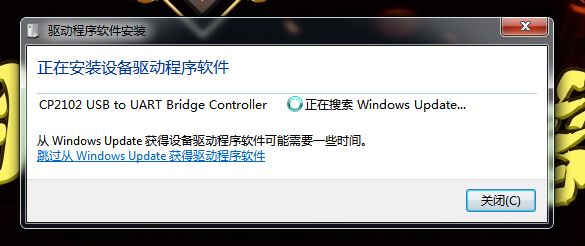

如果驱动安装失败，则需要手动安装驱动。请打开计算机的设备管理器，右键单击“计算机”-----单击“属性”-----单击“设备管理器”。在端口
(COM &LPT)或其他设备。黄色感叹号表示CP2102驱动程序安装失败。

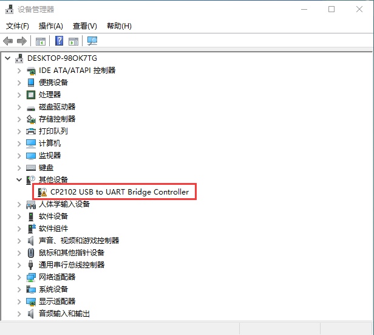

显示CP2102的驱动没有安装成功，有一个黄色的感叹号。我们可以双击硬件更新驱动

点击“浏览我的电脑以查找驱动程序”，找到我们安装或者下载的Mixly1.2软件.

在Mixly1.2软件文件夹里面有一个drivers文件夹，打开drivers文件夹就可以看到CP210X系列芯片的驱动。

点击“浏览(R)...”,选中CP210X系列芯片的驱动，点击“下一步”。

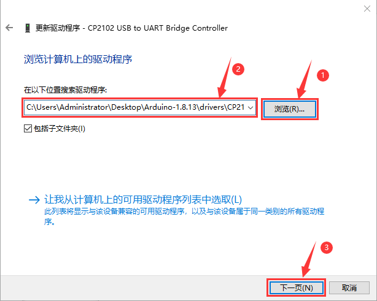

过一会儿，驱动安装成功。

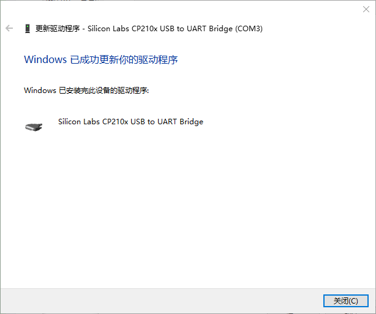

这个时候再打开计算机设备管理器，你就可以看到CP2102的驱动程序已经安装成功了，刚刚的那个黄色的感叹号不见了。

## 1.3. Mixly_Mac安装方法：

1.  MAC必须安装JDK8，而且只能安装JDK8，高版本JAVA不行，可以直接使用云盘目录自带的JDK。

2.  需要安装相应的开源硬件驱动，常用的就是云盘自带的cp210x驱动(<https://www.silabs.com/products/development-tools/software/usb-to-uart-bridge-vcp-drivers>)和ch34x驱动(<https://sparks.gogo.co.nz/ch340.html>)

3.需要自行安装 python3，步骤如下：

从python.org下载python3并安装

以下命令行操作

sudo xcode-select --install

ruby -e "$(curl -fsSL https://raw.githubusercontent.com/Homebrew/install/master/install)"

brew install portaudio

pip3 install pyaudio

brew install opencv

pip3 install opencv-python

pip3 install baidu-aip matplotlib pandas numpy

以上安装需要一个小时以上的时间

4.解压Mixy后双击Mixly.jar即可使用

## 1.4. 在MAC系统上安装驱动：（注意：如果已经安装了驱动程序，则不需要再次安装驱动；如果没有，则需要进行以下操作）

在使用Keyes Uno Plus控制板之前，必须安装它的驱动程序，否则它将无法与MAC
系统设备通信。与Arduino UNO R3的USB系列芯片(ATMEGA8U2)不同，Keyes Uno Plus控制板采用了USB系列芯片CP2102芯片和USB C型接口。在Mixly1.2软件中的Arduino IDE
是1.8.0版本及以上版本，1.8.0版本及以上版本中包含了CP2102芯片的驱动程序。通常，您将控制板通过USB线连接到MAC
系统设备，MAC 系统设备就会识别到硬件，MAC
系统就会自动安装CP2102的驱动。过一会儿，CP2102 驱动就会安装成功。

注意：如果上传代码程序成功了，则不需要再安装驱动，可以跳过下面安装驱动的步骤；如果没有上传成功，则需要跟着下面的步骤安装CP2102驱动。执行下面（1）~（12）步。

（1）CP2102驱动下载链接：

<https://www.silabs.com/products/development-tools/software/usb-to-uart-bridge-vcp-drivers>

（2）点击下载MacOS 版本。

（3）解压下载好的压缩包。

（4）打开文件夹，双击SiLabsUSBDriverDisk.dmg文件。

可以看到以下文件。

（5）双击 Install CP210x VCP Driver 等待界面。

（6）点击Continue

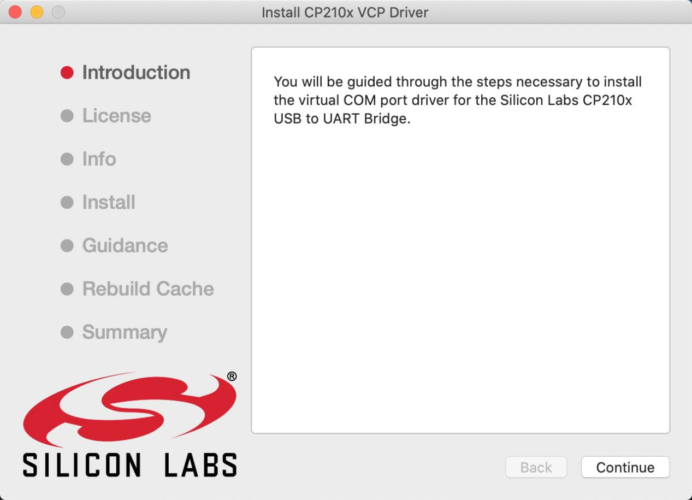

（7）先点击Agree ，然后点击Continue

（8）继续点击Continue ，然后输入你的用户密码

（9）回到安装界面，根据提示等待安装

（10）安装成功

（11）打开Mixly1.2软件，点击，选择主板为Arduino Uno ，串口为/dev/cu.usbserial-0001

（12）然后再点击“上传”，就可以看到烧录成功。

2.starter_kit库文件的导入方法：

（以下是以Windows系统为例，MacOS系统可以参考）

（注意：如果starter_kit库文件已经导入了，则不需要再次导入；如果没有，则需要进行以下操作）

（1）从Mixly项目开始，第一步你应该导入相应的库文件。

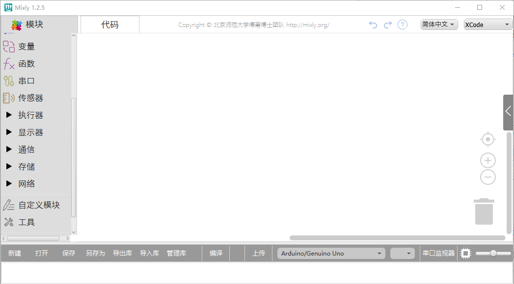

2.  解压我们提供的keyes学习套件库包

    

3.  打开Mixly1.2软件，在Mixly窗口中，先点击“导入库”，然后点击“本地导入”，最后再选择导入库文件starter_kit。你也可以双击以打开库文件starter_kit。这样，starter_kit库文件就添加完成了。

    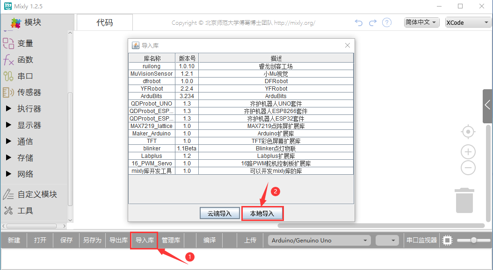

    

    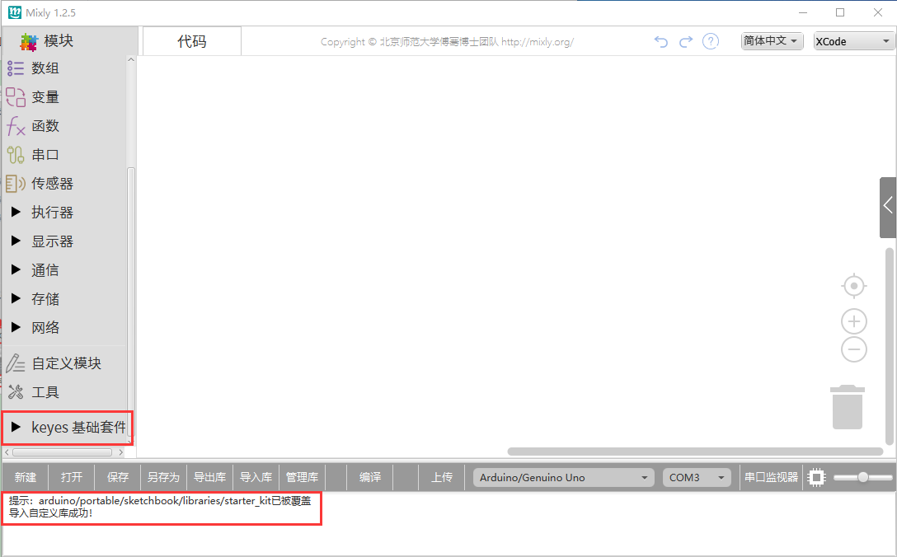

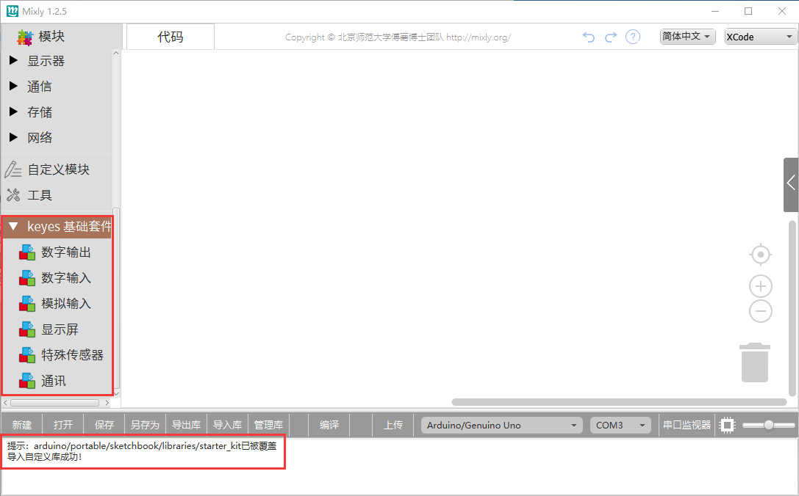

另外，如果使用完库文件后，不再需要该库文件，也是可以删除该库文件的，如下操作示意图：

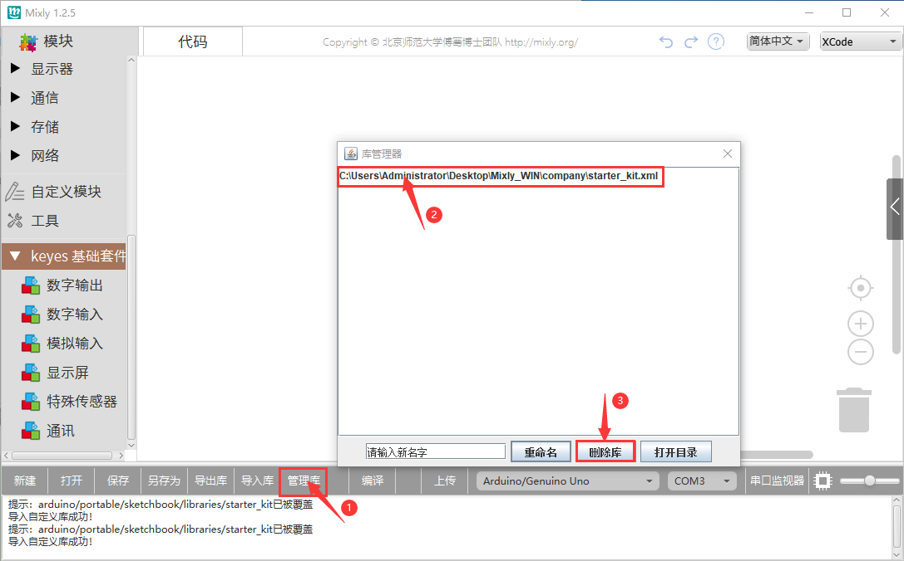

